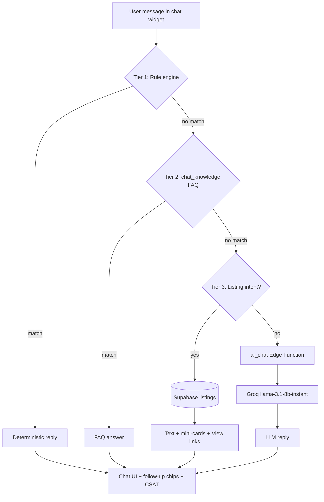

# ShareEat FYP — AI Report Pack (Chapter 4, 6 & Demo)

Copy sections below into your report. Open the visual diagram at **[AI-ARCHITECTURE-DIAGRAM.HTML](./AI-ARCHITECTURE-DIAGRAM.HTML)** in a browser.

---

## 1. Chapter 4 — AI Architecture Diagram

**Figure 4.X Layered Architecture of the ShareEat AI Assistant**

Use the HTML diagram ([AI-ARCHITECTURE-DIAGRAM.HTML](./AI-ARCHITECTURE-DIAGRAM.HTML)) or export as PNG for Word.

**Mermaid (for draw.io / Mermaid Live Editor):**

**Figure caption (paste under diagram):**

> Figure 4.X illustrates the layered architecture of the ShareEat AI Assistant. User input is evaluated sequentially through a rule-based engine, a trainable FAQ database (`chat_knowledge`), and live listing retrieval from Supabase. Only unresolved queries invoke the Groq large language model via the `ai_chat` Supabase Edge Function, where the API key is stored server-side. All response paths converge in the chat interface, which supports follow-up chips and satisfaction feedback.

---

## 2. Chapter 6 — AI Test Table

**Table 6.X Test Cases for the AI Assistant Module**

| Test ID | Category | Test input / action | Expected result | Actual result | Pass / Fail |
|---------|----------|---------------------|-----------------|---------------|-------------|
| T-AI-01 | Rule engine | “Can I cancel after the store confirms?” | Reply explains pending vs confirmed cancellation; chips e.g. Go to Profile | | |
| T-AI-02 | Live listings | “List free food” | Top free listings from DB; View links; no generic fallback | | |
| T-AI-03 | Live listings | “Show cheap options” | Listings sorted by price; mini-cards or structured list | | |
| T-AI-04 | FAQ / knowledge base | “What makes ShareEat different from delivery apps?” | Pickup-only answer (no delivery service) | | |
| T-AI-05 | Navigation | Tap “Go to Profile” chip | “Opening Profile…” then redirect to `profile.html` | | |
| T-AI-06 | Rate limiting | Send 11+ messages within 1 minute | “Slow down — max 10 messages per minute” | | |
| T-AI-07 | LLM fallback | “Write a one-line poem about reducing food waste” | Custom Groq-generated paragraph (not generic chips only) | | |
| T-AI-08 | LLM proxy | `curl POST …/functions/v1/ai_chat` with valid anon key | JSON `{ "reply": "..." }` | | |
| T-AI-09 | Security | Inspect browser Network tab on LLM query | No `gsk_` or Groq key in client requests | | |
| T-AI-10 | CSAT | Thumbs down on a bot reply | “Thanks for the feedback” + clarifying follow-up | | |

**Testing notes (paragraph for Chapter 6):**

> AI assistant testing was conducted manually across four response pathways: rule-based intents, FAQ keyword matching, live listing retrieval, and Groq LLM fallback. Test cases T-AI-01 to T-AI-06 validated deterministic behaviour without external API dependency. Test cases T-AI-07 to T-AI-09 confirmed Groq integration via the `ai_chat` Edge Function and verified that third-party credentials remain server-side. Token usage was monitored through the Groq organisation dashboard to ensure operation within free-tier limits (30 requests/minute, 6,000 tokens/minute for `llama-3.1-8b-instant`).

---

## 3. Limitations — AI Assistant

**Section X.X Limitations of the AI Assistant (paste into Limitations / Future Work)**

> Although the ShareEat AI Assistant provides contextual support across buyer-facing pages, several limitations were identified during implementation and testing. First, the assistant is predominantly English-oriented for LLM-generated responses, while the broader application interface supports multiple languages (English, Bahasa Malaysia, Chinese, and Tamil); full multilingual parity for AI replies was not implemented within the project scope. Second, the system employs a layered design in which rule-based logic and FAQ matching precede LLM invocation; consequently, open-ended questions that partially overlap with keyword patterns may be answered by the knowledge base rather than the language model, which is intentional for cost control but may appear inconsistent to users expecting exclusively generative responses. Third, Groq integration is subject to free-tier rate limits (30 requests per minute and 6,000 tokens per minute), and excessive concurrent usage during demonstrations could trigger throttling; server-side token caps and client-side rate limiting (ten messages per minute) were implemented to mitigate this risk. Fourth, FAQ content in `chat_knowledge` requires manual curation and does not automatically learn from unmatched queries without administrative intervention. Fifth, the assistant does not perform natural-language order modification or payment processing; transactional actions remain confined to explicit UI workflows. Future enhancements may include streaming responses, expanded FAQ automation from `chat_unmatched` logs, tighter i18n alignment for LLM prompts, and optional on-device or cached responses for offline scenarios.

---

## 4. Viva Demo Script (3 questions + backup)

**Duration:** ~2 minutes | **Page:** Home (`user-home.html`) | **Hard refresh:** Cmd+Shift+R first

| Step | Say to examiner | Type / tap in chat | Point out |
|------|-----------------|-------------------|-----------|
| 1 | “First, live data — not AI guessing.” | **List free food** | Store names, prices, **View** links from Supabase |
| 2 | “Second, our FAQ database — no API cost.” | **What makes ShareEat different from regular delivery apps?** | Pickup-only answer from `chat_knowledge` |
| 3 | “Third, Groq LLM only when rules and FAQ don’t match.” | **Write a one-line poem about saving food from waste** | Creative reply; mention `ai_chat` + server-side key |

**Backup if LLM slow/fails:**  
“Layers 1 and 2 handle 90% of demo queries; Groq is optional fallback — token usage is in Groq dashboard.”

**One-liner architecture:**  
“Rules → FAQ → Live listings → Groq via Edge Function — API key never in the browser.”

---

## 5. Pre-presentation checklist

- [ ] Supabase project **unpaused**
- [ ] Edge Function secrets set: `LLM_API_KEY`, `LLM_BASE_URL`, `LLM_MODEL`
- [ ] Live app or local dev: hard refresh (Cmd+Shift+R)
- [ ] Run demo script steps 1–3 once before viva
- [ ] Export diagram PNG from `AI-ARCHITECTURE-DIAGRAM.HTML` for report
- [ ] Fill **Actual result / Pass** column in Table 6.X after testing

---

*Prepared for CPT6314 Project II — ShareEat (Myra Ophelia Iman Maurice Feizal)*

<a href="README.md">← AI docs index</a> · <a href="../README.md">Main README</a>

