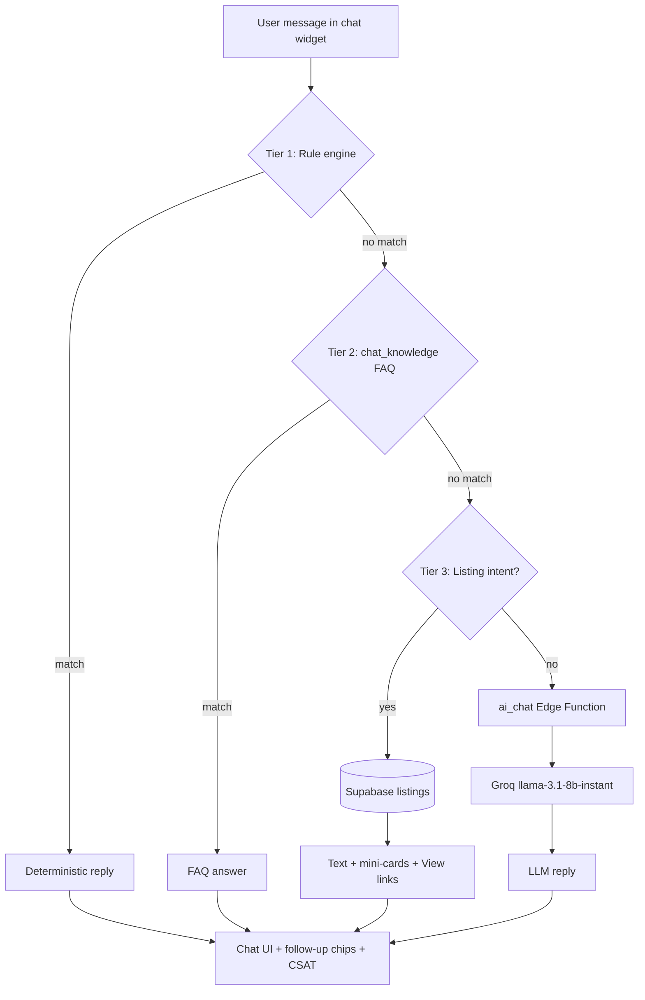

# AI Help Chat — How It Works

Developer guide for the ShareEat **AI Help Chat** widget: layered response pipeline, Supabase integration, and Groq LLM fallback.

Visual diagram → open **[AI-ARCHITECTURE-DIAGRAM.HTML](./AI-ARCHITECTURE-DIAGRAM.HTML)** in a browser.

Implementation reference → **[AI-ASSISTANT.md](./AI-ASSISTANT.md)** (features, schema, storage keys).

---

## Overview

The chat widget runs on **buyer-facing pages** and answers user questions through a **four-tier pipeline**. Cheaper, deterministic layers run first; the LLM is invoked only when nothing else matches.

| Tier | Layer | Source | Cost |
|------|-------|--------|------|
| 1 | Rule engine | `chat-widget.js` | None |
| 2 | FAQ knowledge base | Supabase `chat_knowledge` | None |
| 3 | Live listings | Supabase `listings` | None |
| 4 | LLM fallback | Groq via `ai_chat` Edge Function | API usage |

Design goals: **fast replies**, **predictable behaviour** for common intents, **no API key in the browser**, and **cost control** by limiting LLM calls.

---

## Request flow



### Step-by-step

1. **User sends a message** — `chat-widget.js` reads input, applies client rate limit (10 messages/min), and appends to local history.
2. **Tier 1 — Rules** — Pattern matching for orders, refunds, navigation, promos, escalation, page context (bag, checkout, pickup). Returns immediately on match.
3. **Tier 2 — FAQ** — Keyword scoring against `chat_knowledge`. Admin-curated Q&A; no external API.
4. **Tier 3 — Listings** — Detects discovery intents (“free food”, “cheap options”, filters). Queries Supabase, renders mini-cards with **View** links to listing detail pages.
5. **Tier 4 — LLM** — Unmatched messages POST to Supabase Edge Function `ai_chat`, which calls Groq with a server-side API key. Response streams back as plain text to the widget.
6. **UI layer** — All paths render in the chat panel with optional follow-up chips, thumbs up/down (CSAT), and escalation to human support when needed.

Unmatched queries (no tier matched before LLM, or low-confidence cases) can be logged to `chat_unmatched` for FAQ improvement.

---

## Key files

| Location | Role |
|----------|------|
| `js/chat-widget.js` | Widget UI, tier routing, Supabase calls, rate limiting |
| `chat-widget.css` | Widget styles, mobile full-screen, accessibility |
| `supabase/functions/ai_chat/` | Edge Function — Groq proxy, token caps |
| `supabase-chat-*.sql` | Migrations for messages, escalations, unmatched, promo RPC |
| `SHAREEAT_AI_SYSTEM_PROMPT.md` | System prompt (private source repo only) |

Buyer pages that load the widget: `user-home`, map, bag, profile, checkout, shop detail, listing detail, pickup.

---

## Configuration

Edge Function secrets (Supabase dashboard → Edge Functions → `ai_chat`):

| Secret | Purpose |
|--------|---------|
| `LLM_API_KEY` | Groq API key (`gsk_…`) — **never** in frontend |
| `LLM_BASE_URL` | Groq API base URL |
| `LLM_MODEL` | e.g. `llama-3.1-8b-instant` |

Optional client override (private repo / local dev):

```js
window.SHAREEAT_AI_API_URL = '<supabase>/functions/v1/ai_chat';
```

Pages can set context before the widget loads:

```js
window.shareeatChatContext = {
  storeName: 'GreenBowl',
  listingId: '…',
  hasActiveOrder: true,
  page: 'bag'
};
```

---

## Security

- Groq credentials live **only** in Edge Function secrets.
- Verify in browser DevTools → Network: no `gsk_` strings in client requests.
- LLM path uses Supabase anon key + RLS; Edge Function validates and proxies.
- Client rate limit: 10 messages/minute per session.
- Server-side token caps in `ai_chat` to stay within Groq free tier (30 req/min, 6k tokens/min for `llama-3.1-8b-instant`).

---

## Data layer

| Table / RPC | Purpose |
|-------------|---------|
| `chat_messages` | Persisted user/assistant messages, CSAT |
| `chat_escalations` | Human support cases with reference numbers |
| `chat_unmatched` | Logged queries for FAQ gaps |
| `chat_knowledge` | Trainable FAQ rows (keyword → answer) |
| `update_chat_satisfaction` | RPC — thumbs up/down by `client_ref` |
| `chat_check_promo_code` | RPC — validate promo codes in chat |

Admin review: `admin-chat-logs.html` (CSAT, escalations, unmatched tabs).

Full column definitions → **[AI-ASSISTANT.md](./AI-ASSISTANT.md#database-schema)**.

---

## Extending the assistant

### Add a rule (Tier 1)

In `chat-widget.js`, add intent patterns and a handler that returns `{ reply, chips? }`. Prefer rules for transactional flows (orders, navigation) where behaviour must be exact.

### Add FAQ content (Tier 2)

Insert rows into `chat_knowledge` with keywords and answer text. Review `chat_unmatched` periodically and promote frequent gaps to new FAQ entries.

### Add listing intent (Tier 3)

Extend keyword detection and Supabase query filters (e.g. dietary prefs from `localStorage` key `shareeat_chat_dietary`).

### Change LLM behaviour (Tier 4)

Edit system prompt in private repo `SHAREEAT_AI_SYSTEM_PROMPT.md`, redeploy `ai_chat`, and test with open-ended queries that do not hit Tiers 1–3.

### Add widget to a new page

1. `<link rel="stylesheet" href="chat-widget.css" />`
2. `<script src="js/chat-widget.js"></script>` (after Supabase + i18n)
3. Optionally set `window.shareeatChatContext`.

---

## Testing

Manual smoke tests before deploy:

| Scenario | Input | Expected |
|----------|-------|----------|
| Rule engine | “Can I cancel after the store confirms?” | Cancellation policy; nav chips |
| Live listings | “List free food” | Real listings from DB with View links |
| FAQ | “What makes ShareEat different from delivery apps?” | Pickup-only answer from `chat_knowledge` |
| Navigation chip | Tap “Go to Profile” | Redirect to `profile.html` |
| Rate limit | 11+ messages in 1 minute | “Slow down — max 10 messages per minute” |
| LLM fallback | Open-ended question not in FAQ/rules | Groq-generated reply via Edge Function |
| Security | Inspect Network on LLM query | No Groq key in client |
| CSAT | Thumbs down on bot reply | Feedback ack + clarifying follow-up |

Edge Function check:

```bash
curl -X POST "$SUPABASE_URL/functions/v1/ai_chat" \
  -H "Authorization: Bearer $SUPABASE_ANON_KEY" \
  -H "Content-Type: application/json" \
  -d '{"message":"Hello"}'
```

Expected: JSON `{ "reply": "..." }`.

---

## Known limitations

- **English-first LLM** — UI supports EN / BM / ZH / TA; generative replies are predominantly English.
- **Layered precedence** — Keyword overlap may route to FAQ instead of LLM (by design for cost control).
- **Groq rate limits** — Throttling possible under heavy demo load; monitor Groq dashboard.
- **Manual FAQ curation** — `chat_knowledge` does not auto-learn without admin action on `chat_unmatched`.
- **No transactional LLM actions** — Orders, payments, and bag changes stay in explicit UI flows.

Planned improvements: streaming responses, i18n-aligned LLM prompts, FAQ automation from unmatched logs, optional offline cached answers.

---

<p align="center"><a href="README.md">← AI docs index</a> · <a href="../README.md">Main README</a></p>
