# ShareEat – Full System Class Diagram (Detailed)

**Project:** PROJECT_02_2026 (FYP)  
**Architecture:** Static HTML/CSS/JS frontend + Supabase (PostgreSQL, Auth, Storage, PostgREST)  
**Notation:** UML class diagram for **domain entities** (database tables). Frontend uses **JavaScript modules** (functions), shown as `<<module>>` stereotypes.

---

## Table of contents

1. [System overview](#1-system-overview)
2. [Entity inventory (all tables)](#2-entity-inventory-all-tables)
3. [Identity & profiles](#3-identity--profiles)
4. [Marketplace – listings](#4-marketplace--listings)
5. [Orders & pickup](#5-orders--pickup)
6. [Reviews, ratings & favourites](#6-reviews-ratings--favourites)
7. [Promotions & platform promos](#7-promotions--platform-promos)
8. [Chat, support & feedback](#8-chat-support--feedback)
9. [Notifications & messaging](#9-notifications--messaging)
10. [Admin, payouts & disputes](#10-admin-payouts--disputes)
11. [Stock alerts & platform config](#11-stock-alerts--platform-config)
12. [Content & audit](#12-content--audit)
13. [Master relationship diagram](#13-master-relationship-diagram)
14. [External services](#14-external-services)
15. [Application layer – pages](#15-application-layer--pages)
16. [Application layer – JavaScript modules](#16-application-layer--javascript-modules)
17. [How to export for report](#17-how-to-export-for-report)

---

## 1. System overview

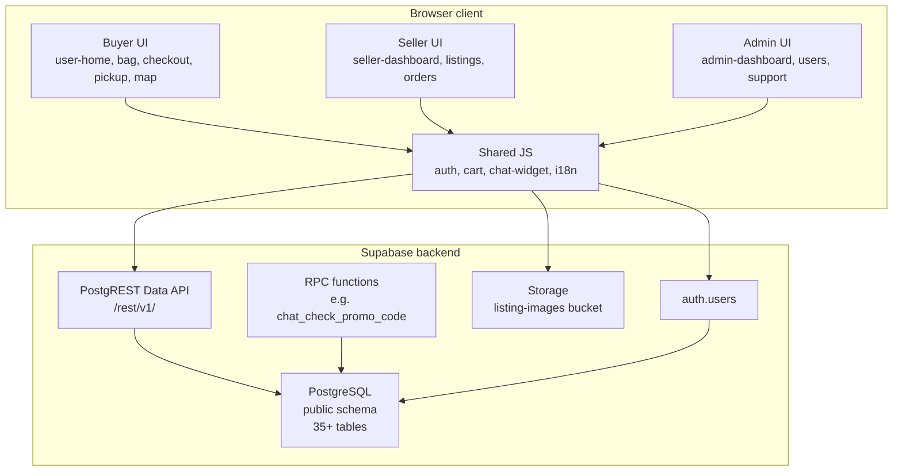
```mermaid
flowchart TB
  subgraph Client["Browser client"]
    BuyerUI["Buyer UI\nuser-home, bag, checkout, pickup, map"]
    SellerUI["Seller UI\nseller-dashboard, listings, orders"]
    AdminUI["Admin UI\nadmin-dashboard, users, support"]
    SharedJS["Shared JS\nauth, cart, chat-widget, i18n"]
  end

  subgraph Supabase["Supabase backend"]
    Auth["auth.users"]
    DB["PostgreSQL\npublic schema\n35+ tables"]
    API["PostgREST Data API\n/rest/v1/"]
    Storage["Storage\nlisting-images bucket"]
    RPC["RPC functions\ne.g. chat_check_promo_code"]
  end

  BuyerUI --> SharedJS
  SellerUI --> SharedJS
  AdminUI --> SharedJS
  SharedJS --> API
  SharedJS --> Auth
  SharedJS --> Storage
  API --> DB
  RPC --> DB
  Auth --> DB
```

---

## 2. Entity inventory (all tables)

| # | Entity (table) | Primary purpose |
|---|----------------|-----------------|
| 1 | `auth.users` | Authentication (Supabase Auth) |
| 2 | `profiles` | User profile, role, seller business info |
| 3 | `listings` | Surprise bags / surplus food offers |
| 4 | `orders` | Buyer checkout orders |
| 5 | `order_items` | Line items per order (multi-seller) |
| 6 | `user_favorites` | Saved listings |
| 7 | `user_saved_shops` | Saved seller shops |
| 8 | `saved_addresses` | Buyer delivery/pickup addresses |
| 9 | `payment_methods` | Saved payment labels (no card PAN) |
| 10 | `notification_preferences` | Email/push prefs |
| 11 | `reviews` | Listing reviews (quality/service/value) |
| 12 | `order_ratings` | Per-order buyer rating |
| 13 | `promotions` | Seller promo codes |
| 14 | `promo_redemptions` | Platform promo usage |
| 15 | `user_shares` | Loyalty share tracking |
| 16 | `user_notifications` | In-app notification feed |
| 17 | `order_messages` | Buyer–seller chat per order |
| 18 | `order_pickup_tokens` | Ask-a-friend pickup share |
| 19 | `chat_messages` | AI assistant conversation log |
| 20 | `chat_escalations` | Human support escalations |
| 21 | `chat_unmatched` | Unanswered AI queries |
| 22 | `support_tickets` | Admin support tickets |
| 23 | `support_ticket_messages` | Ticket thread messages |
| 24 | `listing_reports` | Report listing (quality, no-show) |
| 25 | `order_disputes` | Refund / dispute requests |
| 26 | `user_feedback` | General feedback & reports |
| 27 | `seller_applications` | Become-a-seller workflow |
| 28 | `admin_payouts` | Seller payout batches |
| 29 | `admin_payout_events` | Payout status history |
| 30 | `admin_payout_adjustments` | Manual payout adjustments |
| 31 | `stock_alerts` | Low-stock alert log |
| 32 | `platform_settings` | Key-value platform config |
| 33 | `platform_feature_flags` | Feature toggles |
| 34 | `pickup_reminders_sent` | Pickup reminder dedup log |
| 35 | `seller_revenue_snapshots` | Daily seller revenue |
| 36 | `audit_log` | Sensitive action audit |
| 37 | `content_faqs` | Help centre FAQs |
| 38 | `content_pages` | Terms, privacy, about |
| 39 | `admin_broadcast_log` | Admin broadcast history |
| 40 | `scheduled_broadcasts` | Scheduled emails |
| 41 | `email_provider_events` | Email delivery events |

**View:** `seller_revenue_by_order` (read-only SQL view, not a table).

---

## 3. Identity & profiles

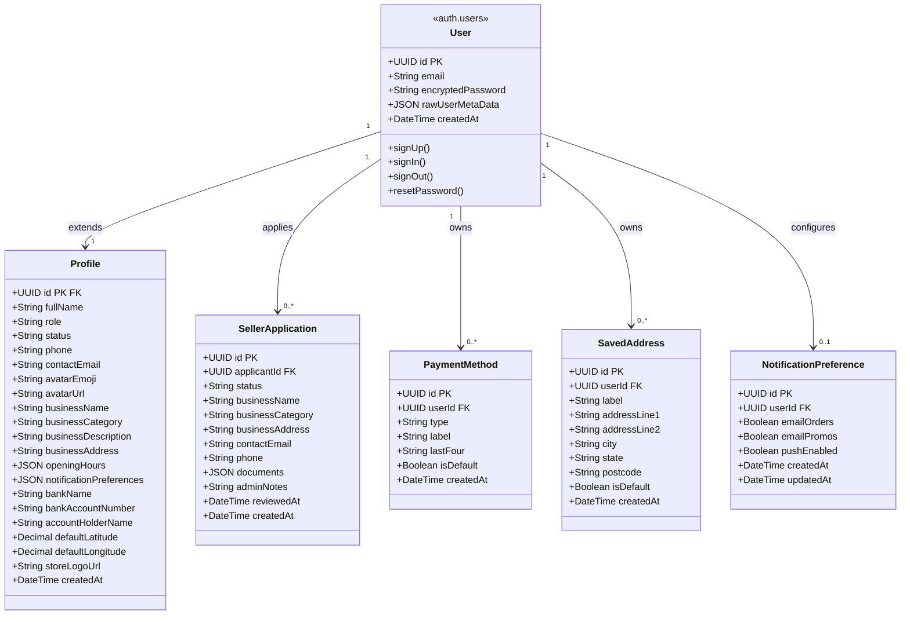
```mermaid
classDiagram
    direction TB

    class User {
        <<auth.users>>
        +UUID id PK
        +String email
        +String encryptedPassword
        +JSON rawUserMetaData
        +DateTime createdAt
        +signUp()
        +signIn()
        +signOut()
        +resetPassword()
    }

    class Profile {
        +UUID id PK FK
        +String fullName
        +String role
        +String status
        +String phone
        +String contactEmail
        +String avatarEmoji
        +String avatarUrl
        +String businessName
        +String businessCategory
        +String businessDescription
        +String businessAddress
        +JSON openingHours
        +JSON notificationPreferences
        +String bankName
        +String bankAccountNumber
        +String accountHolderName
        +Decimal defaultLatitude
        +Decimal defaultLongitude
        +String storeLogoUrl
        +DateTime createdAt
    }

    class SellerApplication {
        +UUID id PK
        +UUID applicantId FK
        +String status
        +String businessName
        +String businessCategory
        +String businessAddress
        +String contactEmail
        +String phone
        +JSON documents
        +String adminNotes
        +DateTime reviewedAt
        +DateTime createdAt
    }

    class PaymentMethod {
        +UUID id PK
        +UUID userId FK
        +String type
        +String label
        +String lastFour
        +Boolean isDefault
        +DateTime createdAt
    }

    class SavedAddress {
        +UUID id PK
        +UUID userId FK
        +String label
        +String addressLine1
        +String addressLine2
        +String city
        +String state
        +String postcode
        +Boolean isDefault
        +DateTime createdAt
    }

    class NotificationPreference {
        +UUID id PK
        +UUID userId FK
        +Boolean emailOrders
        +Boolean emailPromos
        +Boolean pushEnabled
        +DateTime createdAt
        +DateTime updatedAt
    }

    User "1" --> "1" Profile : extends
    User "1" --> "0..*" SellerApplication : applies
    User "1" --> "0..*" PaymentMethod : owns
    User "1" --> "0..*" SavedAddress : owns
    User "1" --> "0..1" NotificationPreference : configures
```

**Profile roles:** `user` (buyer), `seller`, `admin`  
**Profile status:** `active`, `suspended`

---

## 4. Marketplace – listings

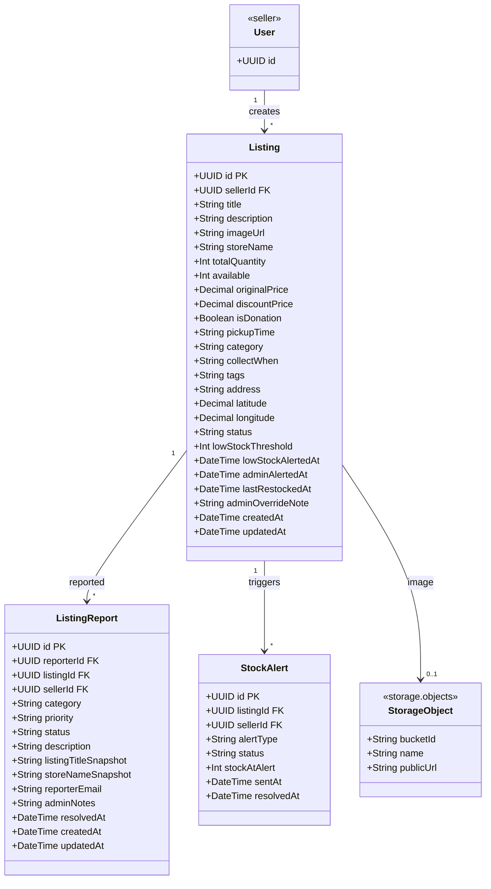
```mermaid
classDiagram
    direction TB

    class User {
        <<seller>>
        +UUID id
    }

    class Listing {
        +UUID id PK
        +UUID sellerId FK
        +String title
        +String description
        +String imageUrl
        +String storeName
        +Int totalQuantity
        +Int available
        +Decimal originalPrice
        +Decimal discountPrice
        +Boolean isDonation
        +String pickupTime
        +String category
        +String collectWhen
        +String tags
        +String address
        +Decimal latitude
        +Decimal longitude
        +String status
        +Int lowStockThreshold
        +DateTime lowStockAlertedAt
        +DateTime adminAlertedAt
        +DateTime lastRestockedAt
        +String adminOverrideNote
        +DateTime createdAt
        +DateTime updatedAt
    }

    class ListingReport {
        +UUID id PK
        +UUID reporterId FK
        +UUID listingId FK
        +UUID sellerId FK
        +String category
        +String priority
        +String status
        +String description
        +String listingTitleSnapshot
        +String storeNameSnapshot
        +String reporterEmail
        +String adminNotes
        +DateTime resolvedAt
        +DateTime createdAt
        +DateTime updatedAt
    }

    class StockAlert {
        +UUID id PK
        +UUID listingId FK
        +UUID sellerId FK
        +String alertType
        +String status
        +Int stockAtAlert
        +DateTime sentAt
        +DateTime resolvedAt
    }

    class StorageObject {
        <<storage.objects>>
        +String bucketId
        +String name
        +String publicUrl
    }

    User "1" --> "*" Listing : creates
    Listing "1" --> "*" ListingReport : reported
    Listing "1" --> "*" StockAlert : triggers
    Listing "1" --> "0..1" StorageObject : image
```

**Listing.category:** `meals`, `bread_pastries`, `groceries`, `flower_plants`, `vegan`, `pasar_malam`, `hotel`  
**Listing.collect_when:** `now`, `today`, `tomorrow`  
**Listing.status:** `active`, `inactive`

---

## 5. Orders & pickup

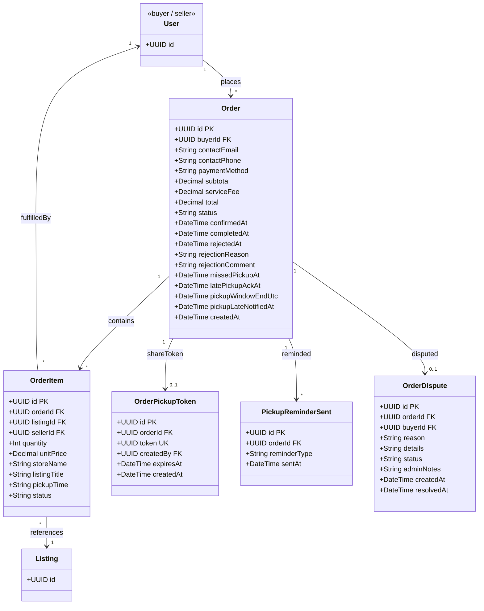
```mermaid
classDiagram
    direction TB

    class User {
        <<buyer / seller>>
        +UUID id
    }

    class Listing {
        +UUID id
    }

    class Order {
        +UUID id PK
        +UUID buyerId FK
        +String contactEmail
        +String contactPhone
        +String paymentMethod
        +Decimal subtotal
        +Decimal serviceFee
        +Decimal total
        +String status
        +DateTime confirmedAt
        +DateTime completedAt
        +DateTime rejectedAt
        +String rejectionReason
        +String rejectionComment
        +DateTime missedPickupAt
        +DateTime latePickupAckAt
        +DateTime pickupWindowEndUtc
        +DateTime pickupLateNotifiedAt
        +DateTime createdAt
    }

    class OrderItem {
        +UUID id PK
        +UUID orderId FK
        +UUID listingId FK
        +UUID sellerId FK
        +Int quantity
        +Decimal unitPrice
        +String storeName
        +String listingTitle
        +String pickupTime
        +String status
    }

    class OrderPickupToken {
        +UUID id PK
        +UUID orderId FK
        +UUID token UK
        +UUID createdBy FK
        +DateTime expiresAt
        +DateTime createdAt
    }

    class PickupReminderSent {
        +UUID id PK
        +UUID orderId FK
        +String reminderType
        +DateTime sentAt
    }

    class OrderDispute {
        +UUID id PK
        +UUID orderId FK
        +UUID buyerId FK
        +String reason
        +String details
        +String status
        +String adminNotes
        +DateTime createdAt
        +DateTime resolvedAt
    }

    User "1" --> "*" Order : places
    Order "1" --> "*" OrderItem : contains
    OrderItem "*" --> "1" Listing : references
    OrderItem "*" --> "1" User : fulfilledBy
    Order "1" --> "0..1" OrderPickupToken : shareToken
    Order "1" --> "*" PickupReminderSent : reminded
    Order "1" --> "0..1" OrderDispute : disputed
```

**Order.status:** `pending`, `confirmed`, `ready`, `completed`, `cancelled`, `late_pickup`  
**Order.payment_method:** `card`, `ewallet`, `bank_transfer`  
**OrderItem.status:** same set as order line state

---

## 6. Reviews, ratings & favourites

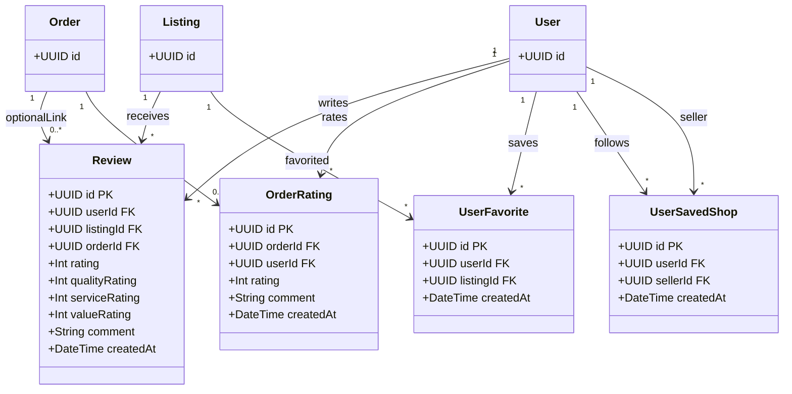
```mermaid
classDiagram
    direction TB

    class User {
        +UUID id
    }

    class Listing {
        +UUID id
    }

    class Order {
        +UUID id
    }

    class Review {
        +UUID id PK
        +UUID userId FK
        +UUID listingId FK
        +UUID orderId FK
        +Int rating
        +Int qualityRating
        +Int serviceRating
        +Int valueRating
        +String comment
        +DateTime createdAt
    }

    class OrderRating {
        +UUID id PK
        +UUID orderId FK
        +UUID userId FK
        +Int rating
        +String comment
        +DateTime createdAt
    }

    class UserFavorite {
        +UUID id PK
        +UUID userId FK
        +UUID listingId FK
        +DateTime createdAt
    }

    class UserSavedShop {
        +UUID id PK
        +UUID userId FK
        +UUID sellerId FK
        +DateTime createdAt
    }

    User "1" --> "*" Review : writes
    User "1" --> "*" OrderRating : rates
    User "1" --> "*" UserFavorite : saves
    User "1" --> "*" UserSavedShop : follows
    Listing "1" --> "*" Review : receives
    Listing "1" --> "*" UserFavorite : favorited
    Order "1" --> "0..*" Review : optionalLink
    Order "1" --> "0..1" OrderRating : rated
    User "1" --> "*" UserSavedShop : seller
```

---

## 7. Promotions & platform promos

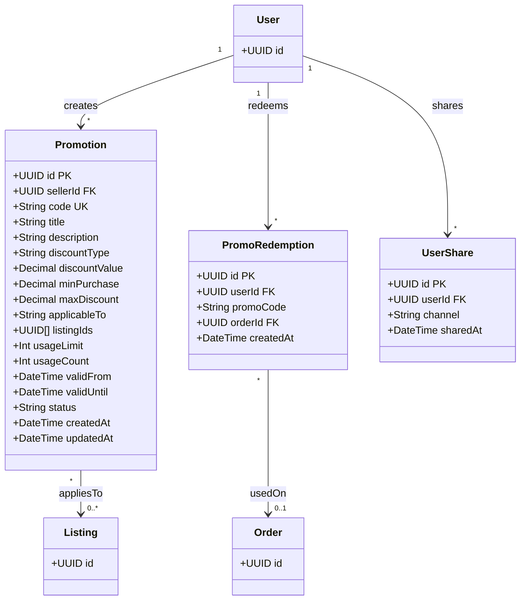
```mermaid
classDiagram
    direction TB

    class User {
        +UUID id
    }

    class Listing {
        +UUID id
    }

    class Order {
        +UUID id
    }

    class Promotion {
        +UUID id PK
        +UUID sellerId FK
        +String code UK
        +String title
        +String description
        +String discountType
        +Decimal discountValue
        +Decimal minPurchase
        +Decimal maxDiscount
        +String applicableTo
        +UUID[] listingIds
        +Int usageLimit
        +Int usageCount
        +DateTime validFrom
        +DateTime validUntil
        +String status
        +DateTime createdAt
        +DateTime updatedAt
    }

    class PromoRedemption {
        +UUID id PK
        +UUID userId FK
        +String promoCode
        +UUID orderId FK
        +DateTime createdAt
    }

    class UserShare {
        +UUID id PK
        +UUID userId FK
        +String channel
        +DateTime sharedAt
    }

    User "1" --> "*" Promotion : creates
    User "1" --> "*" PromoRedemption : redeems
    User "1" --> "*" UserShare : shares
    Promotion "*" --> "0..*" Listing : appliesTo
    PromoRedemption "*" --> "0..1" Order : usedOn
```

**Promotion.discount_type:** `percentage`, `fixed`  
**Promotion.status:** `active`, `inactive`, `expired`

---

## 8. Chat, support & feedback

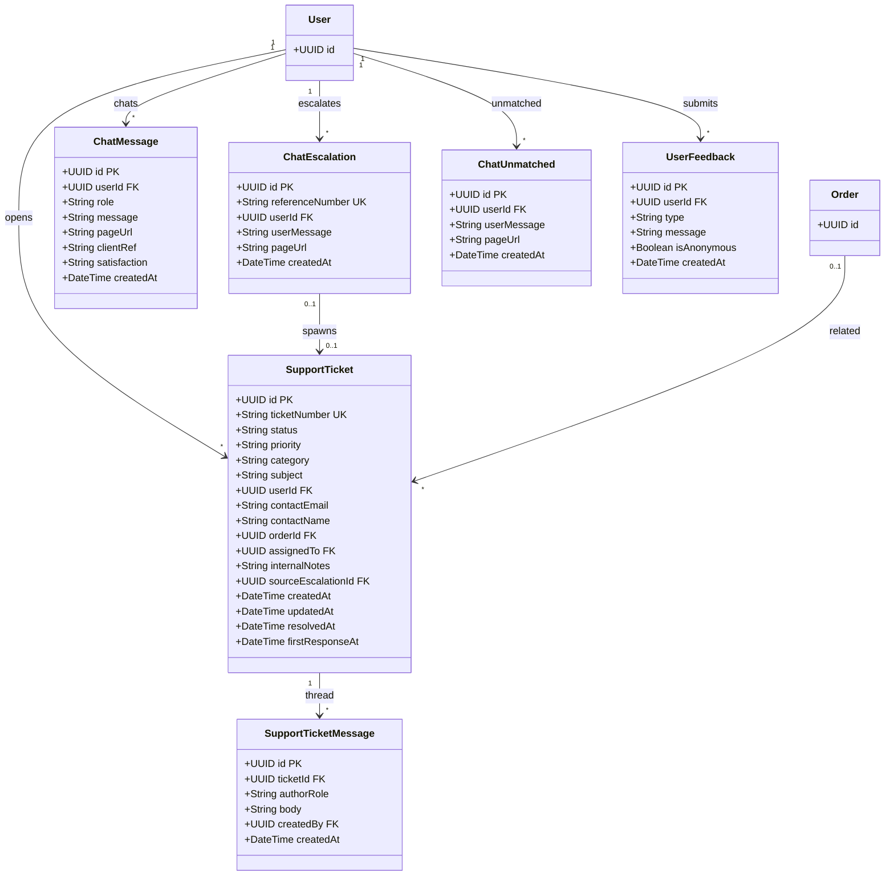
```mermaid
classDiagram
    direction TB

    class User {
        +UUID id
    }

    class Order {
        +UUID id
    }

    class ChatMessage {
        +UUID id PK
        +UUID userId FK
        +String role
        +String message
        +String pageUrl
        +String clientRef
        +String satisfaction
        +DateTime createdAt
    }

    class ChatEscalation {
        +UUID id PK
        +String referenceNumber UK
        +UUID userId FK
        +String userMessage
        +String pageUrl
        +DateTime createdAt
    }

    class ChatUnmatched {
        +UUID id PK
        +UUID userId FK
        +String userMessage
        +String pageUrl
        +DateTime createdAt
    }

    class SupportTicket {
        +UUID id PK
        +String ticketNumber UK
        +String status
        +String priority
        +String category
        +String subject
        +UUID userId FK
        +String contactEmail
        +String contactName
        +UUID orderId FK
        +UUID assignedTo FK
        +String internalNotes
        +UUID sourceEscalationId FK
        +DateTime createdAt
        +DateTime updatedAt
        +DateTime resolvedAt
        +DateTime firstResponseAt
    }

    class SupportTicketMessage {
        +UUID id PK
        +UUID ticketId FK
        +String authorRole
        +String body
        +UUID createdBy FK
        +DateTime createdAt
    }

    class UserFeedback {
        +UUID id PK
        +UUID userId FK
        +String type
        +String message
        +Boolean isAnonymous
        +DateTime createdAt
    }

    User "1" --> "*" ChatMessage : chats
    User "1" --> "*" ChatEscalation : escalates
    User "1" --> "*" ChatUnmatched : unmatched
    User "1" --> "*" SupportTicket : opens
    User "1" --> "*" UserFeedback : submits
    ChatEscalation "0..1" --> "0..1" SupportTicket : spawns
    SupportTicket "1" --> "*" SupportTicketMessage : thread
    Order "0..1" --> "*" SupportTicket : related
```

**ChatMessage.role:** `user`, `assistant`  
**SupportTicket.status:** `open`, `in_progress`, `resolved`  
**UserFeedback.type:** `feedback`, `report`

---

## 9. Notifications & messaging

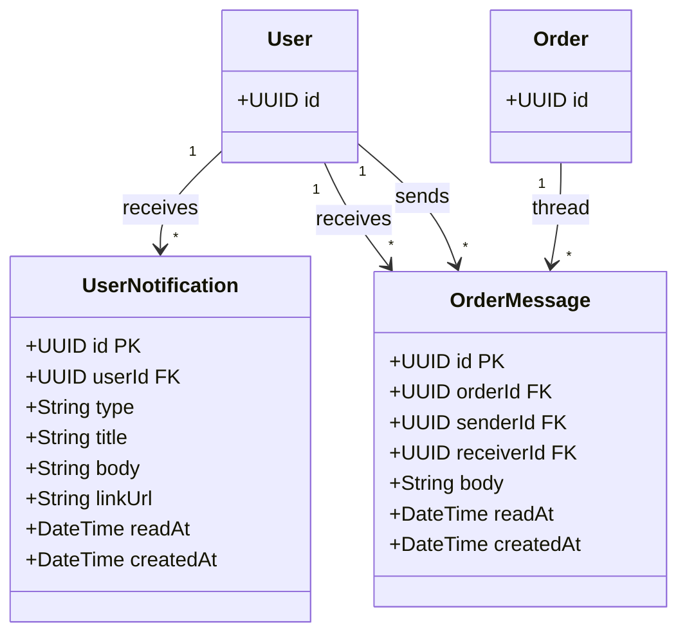
```mermaid
classDiagram
    direction TB

    class User {
        +UUID id
    }

    class Order {
        +UUID id
    }

    class UserNotification {
        +UUID id PK
        +UUID userId FK
        +String type
        +String title
        +String body
        +String linkUrl
        +DateTime readAt
        +DateTime createdAt
    }

    class OrderMessage {
        +UUID id PK
        +UUID orderId FK
        +UUID senderId FK
        +UUID receiverId FK
        +String body
        +DateTime readAt
        +DateTime createdAt
    }

    User "1" --> "*" UserNotification : receives
    Order "1" --> "*" OrderMessage : thread
    User "1" --> "*" OrderMessage : sends
    User "1" --> "*" OrderMessage : receives
```

**Notification types (examples):** `order_ready`, `new_order`, `order_completed`, `low_stock`, `info`

---

## 10. Admin, payouts & disputes

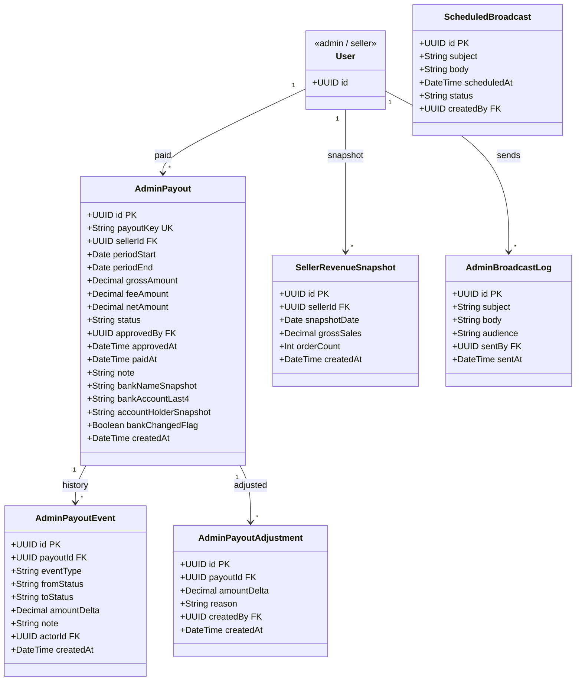
```mermaid
classDiagram
    direction TB

    class User {
        <<admin / seller>>
        +UUID id
    }

    class AdminPayout {
        +UUID id PK
        +String payoutKey UK
        +UUID sellerId FK
        +Date periodStart
        +Date periodEnd
        +Decimal grossAmount
        +Decimal feeAmount
        +Decimal netAmount
        +String status
        +UUID approvedBy FK
        +DateTime approvedAt
        +DateTime paidAt
        +String note
        +String bankNameSnapshot
        +String bankAccountLast4
        +String accountHolderSnapshot
        +Boolean bankChangedFlag
        +DateTime createdAt
    }

    class AdminPayoutEvent {
        +UUID id PK
        +UUID payoutId FK
        +String eventType
        +String fromStatus
        +String toStatus
        +Decimal amountDelta
        +String note
        +UUID actorId FK
        +DateTime createdAt
    }

    class AdminPayoutAdjustment {
        +UUID id PK
        +UUID payoutId FK
        +Decimal amountDelta
        +String reason
        +UUID createdBy FK
        +DateTime createdAt
    }

    class SellerRevenueSnapshot {
        +UUID id PK
        +UUID sellerId FK
        +Date snapshotDate
        +Decimal grossSales
        +Int orderCount
        +DateTime createdAt
    }

    class AdminBroadcastLog {
        +UUID id PK
        +String subject
        +String body
        +String audience
        +UUID sentBy FK
        +DateTime sentAt
    }

    class ScheduledBroadcast {
        +UUID id PK
        +String subject
        +String body
        +DateTime scheduledAt
        +String status
        +UUID createdBy FK
    }

    User "1" --> "*" AdminPayout : paid
    AdminPayout "1" --> "*" AdminPayoutEvent : history
    AdminPayout "1" --> "*" AdminPayoutAdjustment : adjusted
    User "1" --> "*" SellerRevenueSnapshot : snapshot
    User "1" --> "*" AdminBroadcastLog : sends
```

**AdminPayout.status:** `approved`, `paid`, `failed`, `reversed`

---

## 11. Stock alerts & platform config

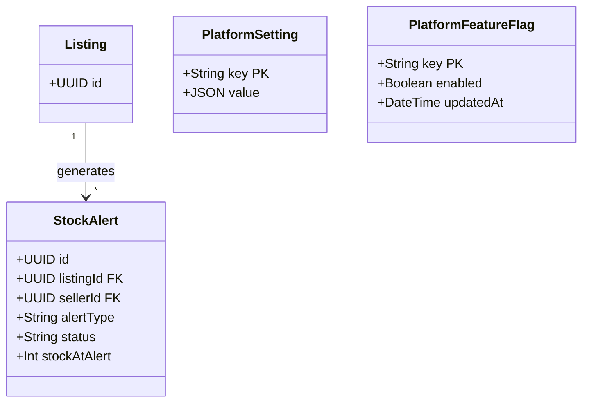
```mermaid
classDiagram
    direction TB

    class Listing {
        +UUID id
    }

    class PlatformSetting {
        +String key PK
        +JSON value
    }

    class PlatformFeatureFlag {
        +String key PK
        +Boolean enabled
        +DateTime updatedAt
    }

    class StockAlert {
        +UUID id
        +UUID listingId FK
        +UUID sellerId FK
        +String alertType
        +String status
        +Int stockAtAlert
    }

    Listing "1" --> "*" StockAlert : generates
```

**StockAlert.alert_type:** `seller_alert`, `admin_escalation`  
**Feature flags (examples):** `seller_promotions`, `buyer_pickup_reminders_ui`

---

## 12. Content & audit

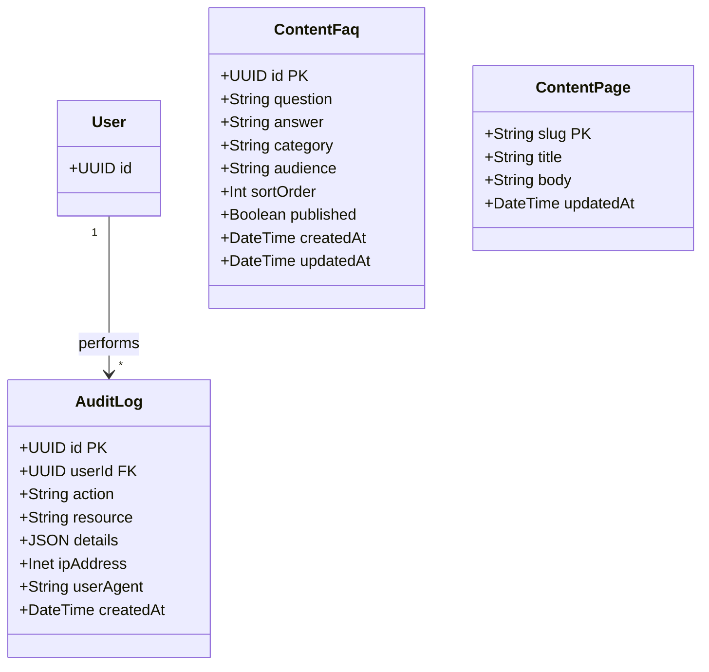
```mermaid
classDiagram
    direction TB

    class User {
        +UUID id
    }

    class ContentFaq {
        +UUID id PK
        +String question
        +String answer
        +String category
        +String audience
        +Int sortOrder
        +Boolean published
        +DateTime createdAt
        +DateTime updatedAt
    }

    class ContentPage {
        +String slug PK
        +String title
        +String body
        +DateTime updatedAt
    }

    class AuditLog {
        +UUID id PK
        +UUID userId FK
        +String action
        +String resource
        +JSON details
        +Inet ipAddress
        +String userAgent
        +DateTime createdAt
    }

    User "1" --> "*" AuditLog : performs
```

**ContentPage.slug:** `terms`, `privacy`, `about`  
**ContentFaq.audience:** `buyer`, `seller`, `both`

---

## 13. Master relationship diagram

All core entities and cardinalities (simplified attributes).

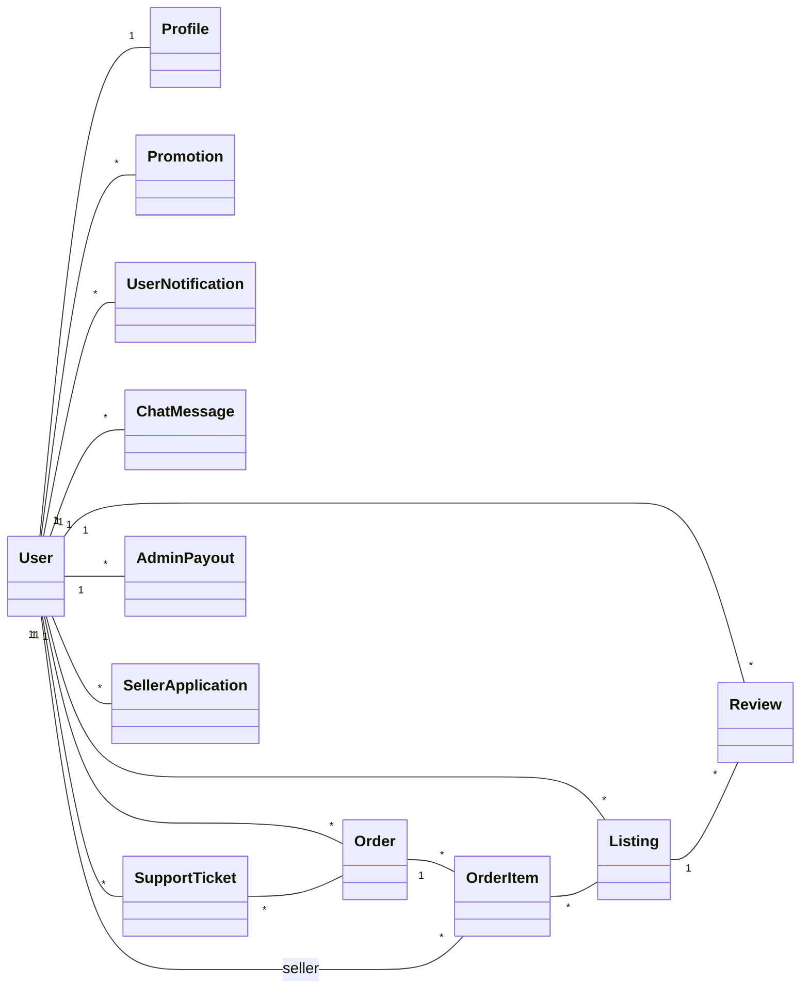
```mermaid
classDiagram
    direction LR

    class User
    class Profile
    class Listing
    class Order
    class OrderItem
    class Review
    class Promotion
    class UserNotification
    class ChatMessage
    class SupportTicket
    class AdminPayout
    class SellerApplication

    User "1" -- "1" Profile
    User "1" -- "*" Listing
    User "1" -- "*" Order
    User "1" -- "*" Review
    User "1" -- "*" Promotion
    User "1" -- "*" UserNotification
    User "1" -- "*" ChatMessage
    User "1" -- "*" SupportTicket
    User "1" -- "*" AdminPayout
    User "1" -- "*" SellerApplication

    Order "1" -- "*" OrderItem
    OrderItem "*" -- Listing
    OrderItem "*" -- User : seller

    Listing "1" -- "*" Review
    SupportTicket "*" -- Order
```

---

## 14. External services

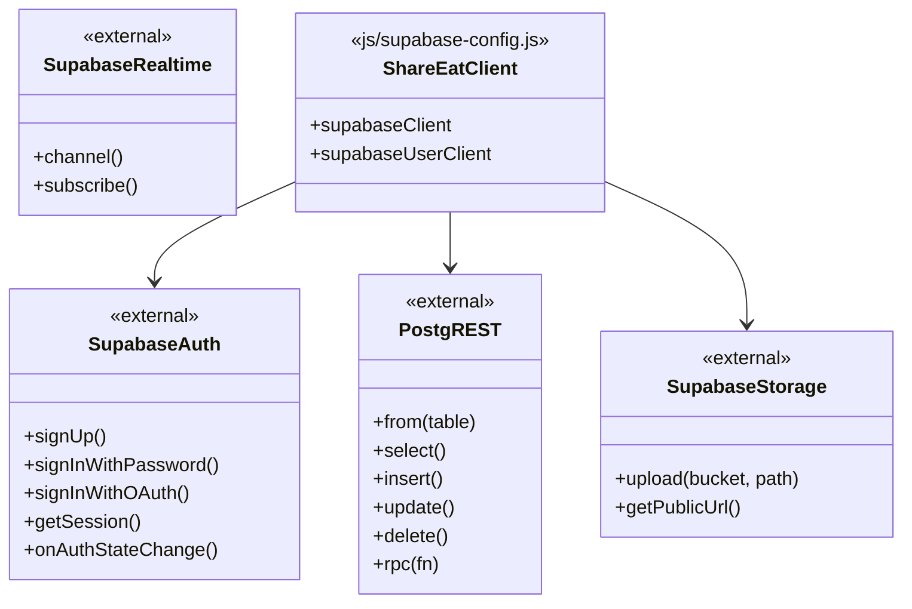
```mermaid
classDiagram
    direction TB

    class SupabaseAuth {
        <<external>>
        +signUp()
        +signInWithPassword()
        +signInWithOAuth()
        +getSession()
        +onAuthStateChange()
    }

    class PostgREST {
        <<external>>
        +from(table)
        +select()
        +insert()
        +update()
        +delete()
        +rpc(fn)
    }

    class SupabaseStorage {
        <<external>>
        +upload(bucket, path)
        +getPublicUrl()
    }

    class SupabaseRealtime {
        <<external>>
        +channel()
        +subscribe()
    }

    class ShareEatClient {
        <<js/supabase-config.js>>
        +supabaseClient
        +supabaseUserClient
    }

    ShareEatClient --> SupabaseAuth
    ShareEatClient --> PostgREST
    ShareEatClient --> SupabaseStorage
```

**Storage bucket:** `listing-images` (public read, authenticated upload)

---

## 15. Application layer – pages

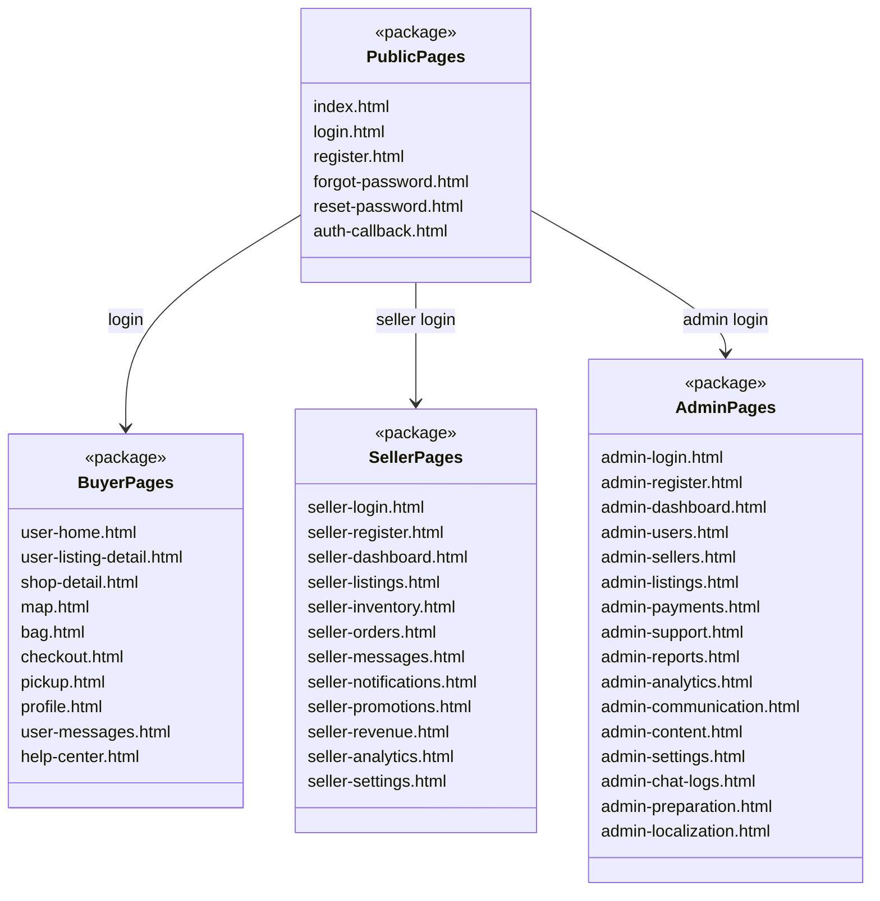
```mermaid
classDiagram
    direction TB

    class PublicPages {
        <<package>>
        index.html
        login.html
        register.html
        forgot-password.html
        reset-password.html
        auth-callback.html
    }

    class BuyerPages {
        <<package>>
        user-home.html
        user-listing-detail.html
        shop-detail.html
        map.html
        bag.html
        checkout.html
        pickup.html
        profile.html
        user-messages.html
        help-center.html
    }

    class SellerPages {
        <<package>>
        seller-login.html
        seller-register.html
        seller-dashboard.html
        seller-listings.html
        seller-inventory.html
        seller-orders.html
        seller-messages.html
        seller-notifications.html
        seller-promotions.html
        seller-revenue.html
        seller-analytics.html
        seller-settings.html
    }

    class AdminPages {
        <<package>>
        admin-login.html
        admin-register.html
        admin-dashboard.html
        admin-users.html
        admin-sellers.html
        admin-listings.html
        admin-payments.html
        admin-support.html
        admin-reports.html
        admin-analytics.html
        admin-communication.html
        admin-content.html
        admin-settings.html
        admin-chat-logs.html
        admin-preparation.html
        admin-localization.html
    }

    PublicPages --> BuyerPages : login
    PublicPages --> SellerPages : seller login
    PublicPages --> AdminPages : admin login
```

---

## 16. Application layer – JavaScript modules

| Module | Responsibility | Main entities used |
|--------|----------------|-------------------|
| `js/supabase-config.js` | Supabase client init | All |
| `js/auth.js` | Login, register, session | User, Profile |
| `js/role-guard.js` | Route protection by role | Profile |
| `js/user-home.js` | Browse listings, filters, Popular today | Listing, Profile |
| `js/user-listing-detail.js` | Listing detail, add to bag | Listing, Review |
| `js/shop-detail.js` | Seller shop page | Listing, Profile |
| `js/map.js` | Map markers, search | Listing |
| `js/cart.js` | Local cart state | Listing |
| `js/bag.js` | Bag UI | Cart, Listing |
| `js/checkout.js` | Place order, promo | Order, OrderItem, Promotion |
| `js/shareeat-checkout-math.js` | Price calculation | Order |
| `js/pickup.js` | Pickup status, complete | Order, OrderItem |
| `js/profile.js` | Profile, orders, favourites | Profile, Order, UserFavorite |
| `js/favorites.js` | Wishlist hearts | UserFavorite |
| `js/chat-widget.js` | AI assistant, top 5 choices | ChatMessage, ChatEscalation, Listing |
| `js/user-messages.js` | Order messaging | OrderMessage |
| `js/seller-dashboard.js` | Seller home metrics | Order, Listing |
| `js/seller-listings.js` | CRUD listings | Listing |
| `js/seller-orders.js` | Manage orders | Order, OrderItem |
| `js/seller-promotions.js` | Promo codes | Promotion |
| `js/seller-revenue.js` | Revenue charts | SellerRevenueSnapshot |
| `js/seller-settings.js` | Business profile | Profile |
| `js/admin-dashboard.js` | Admin KPIs | Multiple |
| `js/admin-users.js` | User management | Profile |
| `js/admin-support.js` | Support tickets | SupportTicket |
| `js/admin-payments.js` | Payouts | AdminPayout |
| `js/admin-listings.js` | Moderate listings | Listing, ListingReport |
| `js/i18n.js` | EN/BM/ZH/TA translations | — |
| `js/categories.js` | Category labels | Listing |
| `js/platform-promo.js` | FIRST3, WEEKEND10 promos | PromoRedemption |
| `js/notification-check.js` | Poll notifications | UserNotification |
| `js/audit-log.js` | Audit helpers | AuditLog |

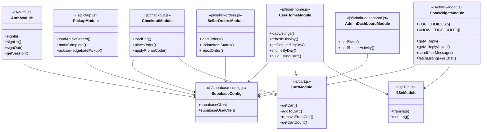
```mermaid
classDiagram
    direction TB

    class SupabaseConfig {
        <<js/supabase-config.js>>
        +supabaseClient
        +supabaseUserClient
    }

    class AuthModule {
        <<js/auth.js>>
        +signIn()
        +signUp()
        +signOut()
        +getSession()
    }

    class UserHomeModule {
        <<js/user-home.js>>
        +loadListings()
        +refreshDisplay()
        +getPopularDisplay()
        +shuffleByDay()
        +buildListingCard()
    }

    class CartModule {
        <<js/cart.js>>
        +getCart()
        +addToCart()
        +removeFromCart()
        +getCartCount()
    }

    class CheckoutModule {
        <<js/checkout.js>>
        +loadBag()
        +placeOrder()
        +applyPromoCode()
    }

    class PickupModule {
        <<js/pickup.js>>
        +loadActiveOrders()
        +markComplete()
        +acknowledgeLatePickup()
    }

    class ChatWidgetModule {
        <<js/chat-widget.js>>
        +TOP_CHOICES[5]
        +getAiReply()
        +getAiReplyAsync()
        +KNOWLEDGE_RULES[]
        +sendUserMessage()
        +fetchListingsForChat()
    }

    class SellerOrdersModule {
        <<js/seller-orders.js>>
        +loadOrders()
        +updateItemStatus()
        +rejectOrder()
    }

    class AdminDashboardModule {
        <<js/admin-dashboard.js>>
        +loadStats()
        +loadRecentActivity()
    }

    class I18nModule {
        <<js/i18n.js>>
        +translate()
        +setLang()
    }

    AuthModule --> SupabaseConfig
    UserHomeModule --> SupabaseConfig
    UserHomeModule --> CartModule
    CheckoutModule --> SupabaseConfig
    CheckoutModule --> CartModule
    PickupModule --> SupabaseConfig
    ChatWidgetModule --> SupabaseConfig
    SellerOrdersModule --> SupabaseConfig
    AdminDashboardModule --> SupabaseConfig
    UserHomeModule --> I18nModule
    ChatWidgetModule --> I18nModule
```

---

## 17. How to export for report

| Method | Steps |
|--------|--------|
| **Cursor / VS Code** | Open this file → Markdown Preview → export or screenshot each diagram |
| **GitHub** | Push repo; diagrams render in README/docs preview |
| **Mermaid Live** | Copy a ` ```mermaid ` block to [https://mermaid.live](https://mermaid.live) → PNG/SVG |
| **draw.io** | Import or redraw from §2 entity table |
| **Live ER diagram** | See [SCHEMA-VISUALIZATION.md](SCHEMA-VISUALIZATION.md) (DBeaver from Supabase) |

### Suggested FYP figure order

1. System overview (§1)  
2. Master relationship (§13)  
3. Orders & pickup (§5)  
4. Application pages (§15)  
5. Chat & support (§8) — if highlighting AI assistant  

---

## Legend

| Symbol | Meaning |
|--------|---------|
| `PK` | Primary key |
| `FK` | Foreign key |
| `UK` | Unique constraint |
| `1`, `*`, `0..1` | UML multiplicity |
| `<<auth.users>>` | Supabase managed table |
| `<<module>>` | JavaScript file / package |
| `+` | Public attribute or operation |

---

*Full system class diagram – ShareEat FYP PROJECT_02_2026. Source: `supabase-*.sql` migrations + `js/*.js` + `*.html` pages.*
