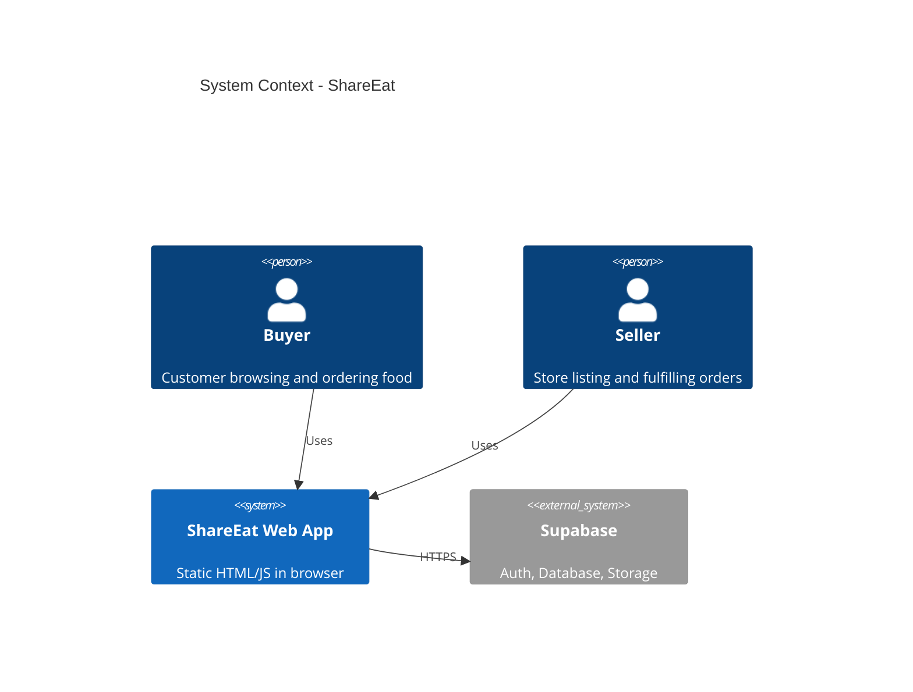
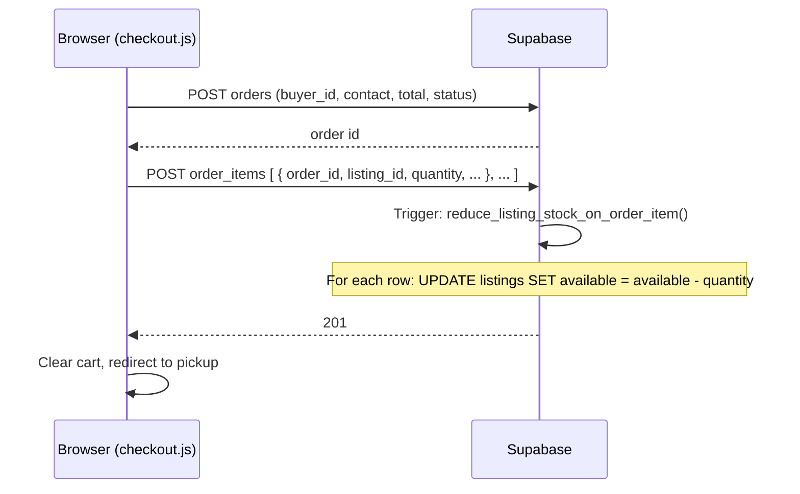
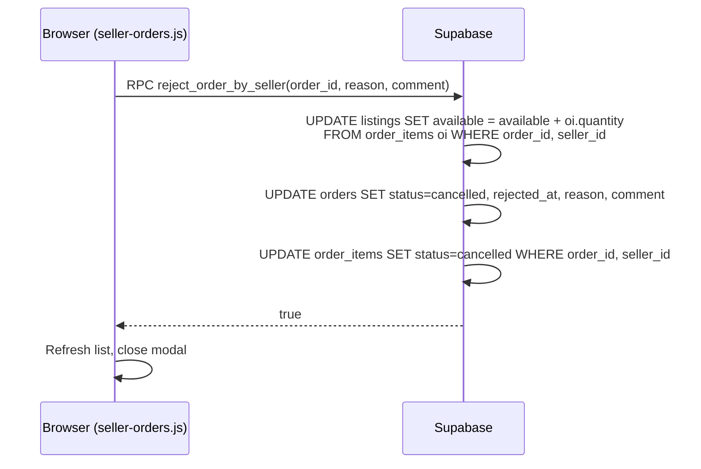
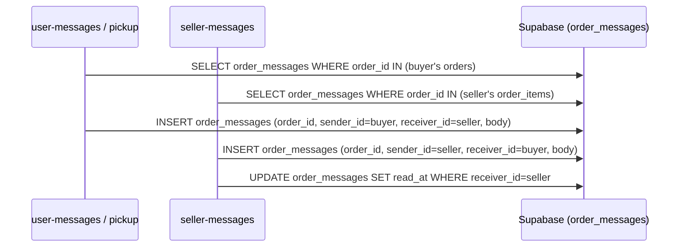
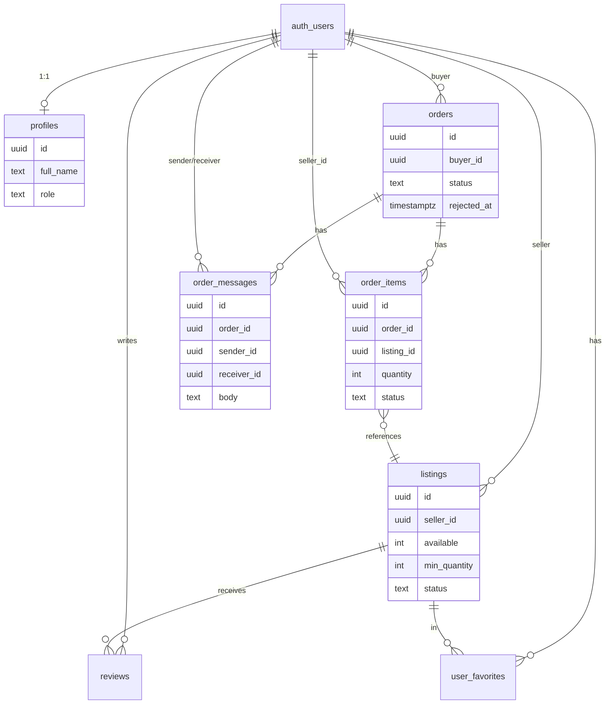

# ShareEat – System Design

This document describes the **system design** of ShareEat: design goals, components, data flows, and key decisions. For schema and file layout, see [SYSTEM_ARCHITECTURE.md](./SYSTEM_ARCHITECTURE.md).

---

## 1. Design Objectives & Scope

| Objective | How it’s addressed |
|-----------|--------------------|
| **Food rescue / last-minute deals** | Listings with discount prices, pickup times; buyers browse and order; sellers fulfill. |
| **Clear buyer–seller separation** | Two auth contexts (user vs seller); separate pages and RLS so buyers and sellers see only their data. |
| **Stock consistency** | Single source of truth: `listings.available`. Reduced on order (DB trigger), restored on reject (RPC). User browse and seller inventory always read the same table. |
| **Order lifecycle** | Orders go through pending → confirmed/ready → completed or cancelled; seller can reject with reason; buyer sees status and messages on pickup page. |
| **Communication** | Order-scoped chat (`order_messages`) so buyer and seller can coordinate pickup. |
| **No custom backend** | Static frontend + Supabase (Auth, Postgres, Storage, RLS) only; no Node/API server to maintain. |

**Out of scope (current design):** Payment processing (UI only), real-time push (polling or page refresh), native mobile apps.

---

## 2. System Context

**Actors**

- **Buyer (User):** Registers/logs in as user, browses listings, adds to bag, checks out, tracks order on pickup, chats with seller, views profile/orders.
- **Seller:** Registers/logs in as seller, manages listings and inventory, accepts/rejects/completes orders, replies to messages.
- **Admin:** Logs in with seller auth storage; admin-specific pages if implemented.
- **Public:** Visits landing page; may see active listings without logging in.

**External systems**

- **Supabase:** Auth (email/Google), Postgres (data + RLS + triggers + RPCs), Storage (listing images). All over HTTPS.
- **Browser:** LocalStorage for cart (and separate auth keys for user vs seller).



---

## 3. Component Design

### 3.1 High-Level Components

```
┌─────────────────────────────────────────────────────────────────────┐
│                     SHAREEAT FRONTEND (Static)                       │
├─────────────────────────────────────────────────────────────────────┤
│  ┌─────────────┐  ┌─────────────┐  ┌─────────────┐  ┌─────────────┐ │
│  │ Auth &     │  │ Browse &    │  │ Order       │  │ Seller      │ │
│  │ routing    │  │ cart        │  │ flow        │  │ dashboard   │ │
│  │ (login/    │  │ (user-home, │  │ (checkout,  │  │ (listings,  │ │
│  │  register, │  │  bag,       │  │  pickup,    │  │  orders,    │ │
│  │  config)   │  │  detail)    │  │  profile)   │  │  inventory, │ │
│  │            │  │             │  │             │  │  messages)  │ │
│  └─────┬──────┘  └─────┬───────┘  └─────┬───────┘  └─────┬───────┘ │
│        │               │                │                │          │
│        └───────────────┴────────────────┴────────────────┘          │
│                                │                                      │
│                        Supabase JS client                             │
│                        (Auth + PostgREST + Storage)                   │
└────────────────────────────────┬─────────────────────────────────────┘
                                 │
                                 ▼
┌─────────────────────────────────────────────────────────────────────┐
│                         SUPABASE                                     │
├──────────────┬──────────────┬──────────────┬─────────────────────────┤
│ Auth         │ Postgres     │ Storage      │ RLS + Triggers + RPCs   │
│ (sessions,   │ (profiles,   │ (listing-    │ (policies,              │
│  providers)  │  listings,   │  images)     │  stock trigger,         │
│              │  orders,     │              │  reject_order_by_seller)│
│              │  order_items│              │                         │
│              │  order_      │              │                         │
│              │  messages…) │              │                         │
└──────────────┴──────────────┴──────────────┴─────────────────────────┘
```

### 3.2 Frontend ↔ Backend Interface

| Frontend action | Supabase usage |
|-----------------|----------------|
| Login / register | `auth.signInWithPassword` / `auth.signUp` / OAuth |
| Load listings | `from('listings').select(...).eq('status','active')` |
| Load cart | LocalStorage (no DB until checkout) |
| Place order | `from('orders').insert(...)` then `from('order_items').insert([...])`; trigger runs on insert |
| Load orders (buyer) | `from('orders').select('*, order_items(*)').eq('buyer_id', uid)` |
| Load orders (seller) | `from('order_items').select('*, orders(...)').eq('seller_id', uid)` |
| Reject order | `rpc('reject_order_by_seller', { p_order_id, p_reason, p_comment })` |
| Inventory add/remove | `from('listings').update({ available }).eq('id', id).eq('seller_id', uid)` |
| Send message | `from('order_messages').insert({ order_id, sender_id, receiver_id, body })` |
| Upload image | `storage.from('listing-images').upload(path, file)` then set `listings.image_url` |

All access is subject to **RLS**: the database enforces who can read/write what.

---

## 4. Data Flows (Key Scenarios)

### 4.1 Place Order & Stock Decrement

Buyer has items in cart → checkout → one order row + N order_item rows. Stock is reduced in the DB so user-home and seller-inventory stay in sync.



- **Design choice:** Stock is updated in a **trigger**, not in the frontend. This keeps one source of truth and avoids races when multiple users buy the same listing.

### 4.2 Seller Rejects Order (Stock Restored)

Seller rejects → RPC updates order and order_items and **restores** `listings.available` for that seller’s items.



- **Design choice:** Restore happens inside the same RPC so it’s atomic with cancelling the order; buyer sees rejection and reason on pickup.

### 4.3 Buyer–Seller Chat (Order-Scoped)

Messages are tied to an order; both buyer and seller can send and read (subject to RLS).



- **Design choice:** One table `order_messages`; RLS ensures buyers only see messages for their orders, sellers only for orders containing their items.

---

## 5. Data Model (Conceptual)

Core entities and relationships:



- **Stock:** Only `listings.available` (and optionally `min_quantity`) is used for inventory and oversell checks; no separate inventory table.
- **Order state:** On `orders`: status (pending → completed/cancelled); rejection fields. On `order_items`: status for seller workflow (pending → confirmed/ready/completed/cancelled).

---

## 6. Design Decisions & Trade-offs

| Decision | Rationale | Trade-off |
|----------|-----------|-----------|
| **Supabase only (no custom API)** | Faster build, one vendor for auth + DB + storage; RLS enforces security at DB. | Less flexibility than a dedicated API layer; vendor lock-in. |
| **Dual Supabase clients (user vs seller)** | Same browser can be buyer in one tab and seller in another without session clash. | Slightly more logic in config; two auth tokens. |
| **Cart in LocalStorage until checkout** | Simple; no DB writes for “add to bag”. | Cart is per-device/browser; no “cart on another device”. |
| **Stock update in DB trigger (on order_items INSERT)** | Single source of truth; atomic with order creation; no double-spend from parallel requests. | Oversell still possible between “read listing” and “insert order_items”; mitigated by checkout-time check and GREATEST(0, available - qty). |
| **Restore stock in reject_order_by_seller RPC** | One place to cancel order + restore stock; consistent for buyer and seller. | Reject is “all items from that seller for that order”; no partial reject per item in this design. |
| **Order-scoped messages (order_messages)** | Simple model; every message tied to an order so buyer/seller context is clear. | No general “inbox” across orders; user goes to order-based threads. |
| **RLS for all tables** | Security in DB; even if frontend is wrong, users can’t read/update others’ data. | Policies must be correct and tested; recursion avoided via helper (e.g. order_has_items_for_seller). |

---

## 7. Security Design

| Layer | Mechanism |
|-------|-----------|
| **Authentication** | Supabase Auth (email/password or Google). JWT in storage per client (user vs seller). |
| **Authorization** | RLS on every table: buyers see own orders/messages; sellers see own listings/orders/items/messages; public sees only active listings. |
| **API** | No custom API; Supabase anon key in frontend. Key is restricted by RLS; no service_role in client. |
| **Sensitive data** | No payment card storage; payment method is label only (card/ewallet/bank_transfer). Contact data (email, phone) in `orders` and profiles as needed. |

---

## 8. Non-Functional Considerations

| Aspect | Current design | Possible evolution |
|--------|----------------|--------------------|
| **Scalability** | Supabase free tier; single region. Frontend is static and cacheable. | Scale via Supabase plan; CDN for static assets; read replicas if needed. |
| **Availability** | Depends on Supabase and static host. No custom server to maintain. | Add health checks; static host SLA. |
| **Consistency** | Strong consistency in Postgres; trigger and RPC are transactional. | Keep single region for simplicity. |
| **Performance** | Indexes on orders(buyer_id, created_at), order_items(order_id, seller_id), listings(seller_id, status); minimal N+1 via select with nested relations. | Add indexes for heavy queries; pagination where lists grow. |
| **Monitoring** | Not in scope. | Add Supabase logs, frontend error reporting (e.g. Sentry), and basic analytics. |

---

## 9. Summary

ShareEat’s system design is:

- **Frontend:** Static HTML/CSS/JS with two Supabase clients (user vs seller).
- **Backend:** Supabase only (Auth, Postgres with RLS, Storage).
- **Stock:** Single source of truth in `listings.available`; reduced by trigger on `order_items` INSERT, restored by `reject_order_by_seller` RPC.
- **Orders & messaging:** Orders and order_items drive lifecycle; order_messages provide order-scoped buyer–seller chat, with RLS enforcing access.

For tables, triggers, RPCs, and file layout, see [SYSTEM_ARCHITECTURE.md](./SYSTEM_ARCHITECTURE.md).
