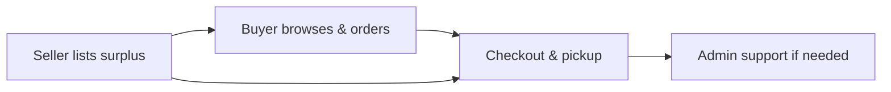

<p align="center">
  <a href="https://shareeat-my.vercel.app/">
    
  </a>
</p>

<h1 align="center">ShareEat</h1>

<p align="center">
  <strong>Full-stack surplus-food marketplace · Malaysia</strong><br />
  <em>Save food · Save money · Save Earth</em>
</p>

<p align="center">
  <a href="https://shareeat-my.vercel.app/"></a>
  
  
  
  <a href="LICENSE"></a>
</p>

<p align="center">
  <a href="https://vercel.com"></a>
  <a href="https://supabase.com"></a>
  
  
  
</p>

<p align="center">
  <a href="#about">About</a> ·
  <a href="#highlights">Highlights</a> ·
  <a href="#live-demo">Demo</a> ·
  <a href="#features">Features</a> ·
  <a href="#architecture">Architecture</a> ·
  <a href="#system-layers">System layers</a> ·
  <a href="#ai-assistant">AI assistant</a> ·
  <a href="#engineering">Engineering</a> ·
  <a href="#documentation">Docs</a> ·
  <a href="#author">Author</a>
</p>

---

## About

**ShareEat** connects food businesses with customers to rescue edible surplus before it is discarded. Sellers list unsold items at reduced prices; buyers browse, order, and collect within a pickup window; administrators manage users, disputes, and platform operations.

Built as **Final Year Project (2026)** in Software Engineering — designed, developed, and deployed end-to-end by a solo developer.

| | |
|---|---|
| **Problem** | Edible food thrown away at closing time while people nearby want affordable meals |
| **Solution** | Listings, checkout, pickup, messaging, notifications, admin support |
| **Impact** | Less waste · lower prices · seller revenue · tracked savings (meals, CO₂, RM) |
| **Market** | Malaysia — EN / BM / ZH / TA, local maps and addresses |
| **SDGs** | UN SDG **12** (Responsible Consumption) · SDG **13** (Climate Action) |

> **Public documentation repo.** Architecture, design decisions, and FYP materials live here. Application source code is **private** and not published.

---

## Highlights

| | |
|---|---|
| **3 role-based portals** | Buyer, Seller, Admin — dedicated workflows and access control |
| **Live production deploy** | Vercel + Supabase — not localhost-only |
| **Security by design** | PostgreSQL RLS, role-based auth, separate session model |
| **Multilingual product** | Full UI in English, Bahasa Malaysia, Chinese, Tamil |
| **Real integrations** | Google Maps, Resend email, Groq AI via Edge Functions, PWA |
| **Documented end-to-end** | 25+ guides, schema docs, FYP requirements |

| Metric | Count |
|--------|------:|
| Web pages | 45+ |
| JavaScript modules | 70+ |
| SQL migrations | 70+ |
| User roles | 3 |
| Languages | 4 |

---

## Live demo

| Portal | URL | Device |
|--------|-----|--------|
| **Home** | [shareeat-my.vercel.app](https://shareeat-my.vercel.app/) | Any |
| **Buyer** | [shareeat-my.vercel.app/user](https://shareeat-my.vercel.app/user) | **Mobile** (PWA) |
| **Seller** | [shareeat-my.vercel.app/seller](https://shareeat-my.vercel.app/seller) | Desktop |
| **Admin** | [shareeat-my.vercel.app/admin](https://shareeat-my.vercel.app/admin) | Desktop |

Support: [support@shareeat.my](mailto:support@shareeat.my)

<p align="center">
  
</p>
<p align="center"><sub>Buyer journey — browse, order, and collect surplus food on mobile</sub></p>

---

## Features

<details>
<summary><strong>Buyer</strong></summary>

- Browse home, map, shop with filters (category, time, price, free items)
- Bag, checkout, pickup tracking, order history, favourites
- Profile, notifications, impact dashboard, badges
- Order chat with seller · tiered AI help chat

</details>

<details>
<summary><strong>Seller</strong></summary>

- Dashboard, listings, inventory, promotions, revenue
- Order lifecycle — confirm, prepare, ready, complete, reject
- Per-order customer messaging and store settings

</details>

<details>
<summary><strong>Admin</strong></summary>

- User and seller management, global listings oversight
- Support desk, disputes, payments, reports, audit logs
- Broadcast email, content management, localisation

</details>

---

## Architecture

ShareEat is a **3-tier web app**: Presentation → Application Logic → Data.  
Static frontend on **Vercel** · **Supabase** as BaaS — no custom Node server.

<p align="center">
  
</p>
<p align="center"><sub>Users & roles · Vercel frontend · Supabase backend · Google Maps · Resend · Groq AI</sub></p>

| Role | Main journey |
|------|----------------|
| **Buyer** | Browse → Bag → Checkout → Pickup → Profile / Messages |
| **Seller** | Listings → Inventory → Orders → Revenue → Messages |
| **Admin** | KPIs → Sellers → Listings → Payments → Support |

**Core flows:** order + stock sync · order-scoped chat · notifications · admin governance



**Deep dives:** [DOCS/SYSTEM_ARCHITECTURE.md](DOCS/SYSTEM_ARCHITECTURE.md) · [DOCS/SYSTEM_DESIGN.md](DOCS/SYSTEM_DESIGN.md) · [DOCS/BACKEND.md](DOCS/BACKEND.md)

---

## System layers

```
┌─────────────────────────────────────────┐
│  TIER 1 — PRESENTATION                  │
│  HTML · CSS · PWA · 3 portals           │
└──────────────────┬──────────────────────┘
                   ▼
┌─────────────────────────────────────────┐
│  TIER 2 — APPLICATION LOGIC (JS)        │
│  Checkout · orders · chat · admin · AI  │
└──────────────────┬──────────────────────┘
                   ▼ HTTPS
┌─────────────────────────────────────────┐
│  TIER 3 — DATA (Supabase)               │
│  Postgres · RLS · triggers · RPC · Edge │
└─────────────────────────────────────────┘
         Google Maps · Resend · Groq (ai_chat)
```

| Tier | Responsibility |
|------|----------------|
| **1 Presentation** | UI only — pages, nav, forms, map canvas, chat shell |
| **2 Application** | Workflows — checkout, inventory, messaging, admin, i18n, AI routing |
| **3 Data** | Source of truth — tables, RLS, triggers, Storage, Edge Functions |

<details>
<summary><strong>Viva Q&amp;A</strong></summary>

| Question | Short answer |
|----------|--------------|
| Where is the backend? | Supabase BaaS — Postgres, Auth, RLS, triggers, Edge Functions |
| Logic only in JavaScript? | UX in Tier 2; **RLS + triggers enforce security in Tier 3** |
| Not full stack without Node? | Full stack = presentation + logic + data; BaaS replaces self-hosted API |
| Is AI just ChatGPT? | No — 3 AI sub-layers; Groq is **last**. See [AI assistant](#ai-assistant) |

</details>

Full tier breakdown → **[DOCS/SYSTEM_ARCHITECTURE.md](DOCS/SYSTEM_ARCHITECTURE.md)**

---

## AI assistant

**Three response types, in order** — most messages never call an external LLM.

| # | Layer | Examples |
|---|-------|----------|
| **1** | Rules & FAQ | `How do I checkout?` · `Where is my order?` |
| **2** | Live Supabase | `Halal food near me` · `List free food` · real listing cards |
| **3** | Groq LLM | `ShareEat vs Grab?` · open Q&A via Edge Function |

**Why Groq?** LLM is last resort · API key server-side only · fast demos · FYP cost control · OpenAI-compatible API.

| Resource | Link |
|----------|------|
| How it works | [AI/HOW-IT-WORKS.md](AI/HOW-IT-WORKS.md) |
| Full module docs | [AI/AI-ASSISTANT.md](AI/AI-ASSISTANT.md) |
| Architecture diagram | [AI/AI-ARCHITECTURE-DIAGRAM.HTML](AI/AI-ARCHITECTURE-DIAGRAM.HTML) |

---

## Engineering

| Decision | Why |
|----------|-----|
| **Supabase BaaS** | Auth, Postgres, Storage, RLS in one platform — ship without a custom API server |
| **Vanilla JavaScript** | No framework lock-in; direct PWA and performance control |
| **Separate auth clients** | Buyer, seller, admin can stay logged in in different tabs |
| **RLS-first security** | Access enforced at the database — not only in frontend |
| **DB triggers & RPCs** | Stock sync and order lifecycle server-side |
| **Edge Functions** | AI proxy, broadcast email — secrets off the client |

**Quality:** automated tests (checkout math, i18n) · GitHub Actions CI · secret scanning · Docker option · Playwright E2E (private repo)

**Skills:** System Design · Full-Stack · PostgreSQL & RLS · OAuth · Vercel · API Integration · i18n · CI/CD · Security

| Layer | Technologies |
|-------|----------------|
| Frontend | HTML5, CSS3, vanilla JS, PWA |
| Backend | Supabase — Postgres, Auth, Storage, RLS, Edge Functions |
| AI | Tiered pipeline → `ai_chat` → Groq (Llama) |
| Integrations | Google Maps, Resend, Vercel |

---

## Documentation

```
ShareEat-s/
├── README.md          ← Overview (you are here)
├── DOCS/              ← Architecture, backend, FYP
├── AI/                ← AI assistant docs & diagrams
└── ASSETS/            ← Logo, screenshots, figures
```

| Topic | Document |
|-------|----------|
| **Start here** | [DOCS/README.md](DOCS/README.md) |
| System architecture | [DOCS/SYSTEM_ARCHITECTURE.md](DOCS/SYSTEM_ARCHITECTURE.md) |
| System design | [DOCS/SYSTEM_DESIGN.md](DOCS/SYSTEM_DESIGN.md) |
| Backend & data flow | [DOCS/BACKEND.md](DOCS/BACKEND.md) |
| Schema & class model | [DOCS/CLASS-DIAGRAM.md](DOCS/CLASS-DIAGRAM.md) · [DOCS/SCHEMA-VISUALIZATION.md](DOCS/SCHEMA-VISUALIZATION.md) |
| FYP requirements | [DOCS/FYP_FUNCTIONAL_REQUIREMENTS_TABLE.md](DOCS/FYP_FUNCTIONAL_REQUIREMENTS_TABLE.md) |
| FYP demo guide | [DOCS/FYP-RUNBOOK.md](DOCS/FYP-RUNBOOK.md) |
| Revenue model | [DOCS/REVENUE_EXPLAINED.md](DOCS/REVENUE_EXPLAINED.md) |
| AI assistant | [AI/HOW-IT-WORKS.md](AI/HOW-IT-WORKS.md) · [AI/AI-ASSISTANT.md](AI/AI-ASSISTANT.md) |

---

## Roadmap

**Shipped:** 3 portals · disputes · i18n · impact badges · tiered AI · order chat · CI

**Planned:** Live FPX/e-wallet · push notifications · native app · streaming LLM · ESG reporting

---

## Author

<table>
  <tr>
    <td width="120"></td>
    <td>
      <strong>Myra Ophelia Iman Binti Maurice Feizal</strong><br />
      Bachelor of Software Engineering · Final Year Project · 2026<br /><br />
      Designed, built, and deployed ShareEat end-to-end.<br /><br />
      <a href="https://github.com/MyraOphelia">GitHub</a> ·
      <a href="https://www.linkedin.com/in/myra-ophelia-iman">LinkedIn</a> ·
      <a href="mailto:support@shareeat.my">Email</a> ·
      <a href="https://shareeat-my.vercel.app/">Live demo</a>
    </td>
  </tr>
</table>

---

## License

Academic coursework — all rights reserved by **Myra Ophelia Iman Binti Maurice Feizal** unless stated by the institution. See **[LICENSE](LICENSE)**.
