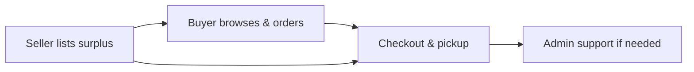
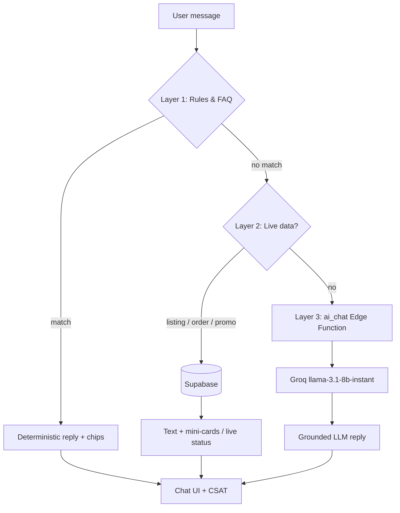

<p align="center">
  <a href="https://shareeat-my.vercel.app/">
    
  </a>
</p>

<h1 align="center">ShareEat</h1>

<p align="center">
  <strong>Full-stack surplus-food marketplace · Malaysia</strong><br />
  <em>Save food · Save money · Save Earth</em>
</p>

<p align="center">
  <a href="https://shareeat-my.vercel.app/"></a>
  
  
  
  <a href="LICENSE"></a>
</p>

<p align="center">
  <a href="https://vercel.com"></a>
  <a href="https://supabase.com"></a>
  
  
  
  
</p>

<p align="center">
  <a href="#about">About</a> ·
  <a href="#highlights">Highlights</a> ·
  <a href="#live-demo">Live demo</a> ·
  <a href="#architecture">Architecture</a> ·
  <a href="#system-architecture-layers">System layers</a> ·
  <a href="#ai-assistant-three-layers">AI layers</a> ·
  <a href="#features">Features</a> ·
  <a href="#engineering">Engineering</a> ·
  <a href="#tech-stack">Tech stack</a> ·
  <a href="#documentation">Documentation</a> ·
  <a href="#author">Author</a>
</p>

---

## About

**ShareEat** is a production-style web platform that connects food businesses with customers to rescue edible surplus before it is discarded. Sellers list unsold items at reduced prices; buyers browse, order, and collect within a pickup window; administrators manage users, disputes, and platform operations.

Built as a **Final Year Project (2026)** in Software Engineering — designed, developed, and deployed end-to-end by a solo developer.

| | |
|---|---|
| **Problem** | Edible food is thrown away at closing time while people nearby want affordable meals. |
| **Solution** | One platform for listings, checkout, pickup, messaging, notifications, and admin support. |
| **Impact** | Less waste · lower prices · seller revenue recovery · tracked savings (meals, CO₂, RM) |
| **Market** | Malaysia — multilingual UI (EN / BM / ZH / TA), local maps and addresses |
| **SDGs** | UN SDG **12** (Responsible Consumption) · SDG **13** (Climate Action) |

> **Public documentation repository.** This repo showcases architecture, design decisions, and FYP materials. Application source code is **private** and not published here.

---

## Highlights

> *What makes this more than a CRUD app — built for real users, real roles, and real deployment.*

| | |
|---|---|
| **3 role-based portals** | Buyer, Seller, and Admin — each with dedicated workflows and access control |
| **Live production deploy** | Hosted on Vercel with Supabase backend — not localhost-only |
| **Security by design** | PostgreSQL Row Level Security (RLS), role-based auth, dual session model |
| **Multilingual product** | Full UI in English, Bahasa Malaysia, Chinese, and Tamil |
| **Real-world integrations** | Google Maps, Resend email, Supabase Edge Functions, PWA support |
| **Mobile-first buyer PWA** | Buyer app optimized for phone; seller & admin portals for desktop |
| **Documented end-to-end** | Architecture diagrams, schema docs, FYP requirements, 25+ markdown guides |

### By the numbers

| Metric | Count |
|--------|------:|
| Web pages (HTML) | 45+ |
| JavaScript modules | 70+ |
| SQL migrations & policies | 70+ |
| User roles | 3 |
| Supported languages | 4 |
| Documentation files | 25+ |

---

## Live demo

Try the deployed app — no install required.

| Portal | URL | Recommended device |
|--------|-----|--------------------|
| **Home** | [shareeat-my.vercel.app](https://shareeat-my.vercel.app/) | Any |
| **Buyer** | [shareeat-my.vercel.app/user](https://shareeat-my.vercel.app/user) | **Mobile** (PWA) |
| **Seller** | [shareeat-my.vercel.app/seller](https://shareeat-my.vercel.app/seller) | **Desktop** |
| **Admin** | [shareeat-my.vercel.app/admin](https://shareeat-my.vercel.app/admin) | **Desktop** |

**Support:** [support@shareeat.my](mailto:support@shareeat.my)

### User experience (Buyer)

ShareEat is a **PWA (Progressive Web App)** — optimized for mobile. **Buyers** should use ShareEat on their **phone** (add to home screen for app-like access). **Seller** and **Admin** portals are designed for **desktop** use.

<p align="center">
  
</p>

<p align="center"><sub>Buyer journey — browse, order, and collect surplus food on mobile</sub></p>

---

## Architecture

ShareEat is a **3-tier client–server web application**: static frontend on **Vercel**, **Supabase** as BaaS (Auth, PostgreSQL, Storage, RLS, Edge Functions). There is no custom Node application server — the browser talks to Supabase over HTTPS.

<p align="center">
  
</p>

<p align="center"><sub>Users & roles · Frontend (Vercel) · Backend (Supabase) · External APIs (Google Maps, Resend, Groq AI)</sub></p>

### Roles & portals

| Role | Auth storage | Main flows |
|------|--------------|------------|
| **Buyer** | `shareeat-user-auth` | Browse → Bag → Checkout → Pickup → Profile / Messages |
| **Seller** | `shareeat-seller-auth` | Listings → Inventory → Orders → Revenue → Messages |
| **Admin** | `shareeat-admin-auth` | KPIs, seller approval, listings, analytics, payments, support |

Separate Supabase clients let **buyer, seller, and admin** stay logged in in different tabs without overwriting sessions.

### Technology stack

| Layer | Technologies |
|-------|----------------|
| **Presentation** | HTML5, CSS3, vanilla JavaScript, PWA, responsive mobile nav |
| **Portals** | Buyer · Seller · Admin (single codebase) |
| **Backend (BaaS)** | Supabase — PostgreSQL, Auth, Storage, RLS, Edge Functions |
| **AI** | Tiered chat pipeline → `ai_chat` Edge Function → **Groq** (Llama) |
| **Email** | Resend (`shareeat.my`) |
| **Maps** | Google Maps JavaScript API + Geocoding API |
| **Hosting** | Vercel (primary) · Docker optional |
| **Tooling** | Node.js, Playwright, GitHub Actions CI |

### Core data flows

1. **Orders & stock** — Checkout inserts `orders` + `order_items`; trigger decrements `listings.available` (single source of truth).
2. **Messaging** — `order_messages` per order; buyer Profile/Pickup chat ↔ seller Messages.
3. **Notifications** — `user_notifications` + in-app toasts (order ready, messages, reminders).
4. **Governance** — Admin RLS, seller approval, listing reports, dispute replies.

**Order flow:**



Deep dives → **[DOCS/SYSTEM_ARCHITECTURE.md](DOCS/SYSTEM_ARCHITECTURE.md)** · **[DOCS/SYSTEM_DESIGN.md](DOCS/SYSTEM_DESIGN.md)** · **[DOCS/BACKEND.md](DOCS/BACKEND.md)**

### System architecture layers (3-tier)

ShareEat follows a **classic 3-tier web architecture**: **Presentation → Application Logic → Data**.  
There is no custom Node/Express server; **Supabase is the managed backend** (PostgreSQL, Auth, RLS, Storage, Edge Functions).

```
┌─────────────────────────────────────────────────────────────┐
│  TIER 1 — PRESENTATION                                       │
│  HTML · CSS · PWA · Buyer / Seller / Admin portals            │
└────────────────────────────┬────────────────────────────────┘
                             │
┌────────────────────────────▼────────────────────────────────┐
│  TIER 2 — APPLICATION LOGIC (JavaScript)                     │
│  Checkout · Orders · Inventory · Chat · Admin · i18n · Maps  │
│  └── AI sub-pipeline: Rules → Live DB → call Tier 3          │
└────────────────────────────┬────────────────────────────────┘
                             │ HTTPS (supabase-js)
┌────────────────────────────▼────────────────────────────────┐
│  TIER 3 — DATA & BACKEND (Supabase BaaS)                     │
│  PostgreSQL · RLS · Triggers · RPC · Storage · Edge Functions │
└────────────────────────────┬────────────────────────────────┘
              ┌──────────────┼──────────────┐
         Google Maps      Resend         Groq (via ai_chat)
```

#### Tier 1 — Presentation (what the user sees)

| Item | Detail |
|------|--------|
| **Purpose** | UI only — pages, layout, navigation, forms, chat widget shell, map canvas |
| **Tech** | HTML5, CSS3, responsive mobile nav, PWA manifest |
| **Portals** | Buyer (mobile-first) · Seller · Admin |

> Presentation does not hold secrets. It renders data and sends user actions to Tier 2.

#### Tier 2 — Application logic (business rules)

| Module | Responsibility |
|--------|----------------|
| **Auth & roles** | Separate sessions for buyer / seller / admin |
| **Browse & cart** | Listings, filters, bag |
| **Checkout** | Validation, totals, place order |
| **Pickup & orders** | Status, swipe confirm, chat modal |
| **Seller ops** | Accept/reject/complete, inventory sync |
| **Admin ops** | KPIs, sellers, listings, payments, support |
| **Messaging** | Order-scoped buyer–seller chat |
| **AI assistant** | Tiered chat routing (see [AI layers](#ai-assistant-three-layers)) |
| **i18n** | EN / BM / ZH / TA UI strings |

> Tier 2 enforces **workflows and UX rules**. Critical security is enforced in Tier 3 (RLS + triggers), not only in the browser.

#### Tier 3 — Data & backend (source of truth)

| Component | Purpose |
|-----------|---------|
| **Tables** | `listings`, `orders`, `order_items`, `order_messages`, `profiles`, … |
| **RLS** | Row-level security per role |
| **Triggers** | Stock sync on order (e.g. `listings.available`) |
| **RPCs** | `reject_order_by_seller`, `chat_check_promo_code`, … |
| **Storage** | `listing-images` bucket |
| **Edge Functions** | `ai_chat` (Groq proxy — API key in Supabase secrets) |

#### Integration services (external)

| Service | Role |
|---------|------|
| **Vercel** | Host static frontend |
| **Google Maps** | Map discovery, geocoding |
| **Resend** | Admin broadcast / email |
| **Groq** | LLM inference — **only** via Edge Function, never in the browser |

#### How the tiers work together (example: place order)

1. **Tier 1** — User taps Checkout.
2. **Tier 2** — App validates contact, computes totals, inserts `orders` + `order_items`.
3. **Tier 3** — Postgres stores rows; trigger reduces `listings.available`; RLS enforces buyer ownership.
4. **Tier 1** — User sees updated status on Pickup.

#### Viva / showcase — common questions

| Question | Answer |
|----------|--------|
| *“Where is your backend?”* | **Supabase BaaS** — PostgreSQL, Auth, RLS, triggers, RPCs, Edge Functions. |
| *“Logic is only in JavaScript?”* | UX logic is Tier 2; **authorization and stock rules are enforced in Tier 3**. |
| *“Not full stack without Node?”* | Full stack = presentation + application + data. **Managed backend** instead of self-hosted Express. |
| *“How is stock kept consistent?”* | **Single source of truth:** `listings.available`. DB trigger on order; restore on reject RPC. |
| *“Is AI just ChatGPT?”* | No. **Three AI sub-layers** — rules, live DB, Groq last. See [AI layers](#ai-assistant-three-layers). |

**30-second summary:**  
*“ShareEat is 3-tier: HTML/CSS presentation, modular JavaScript for buyer/seller/admin logic, and Supabase for data with RLS and triggers. The AI assistant adds three sub-layers — rules, live database, Groq last — with the API key server-side only.”*

---

## AI Assistant — three layers

The ShareEat assistant is **not** “ChatGPT bolted on”. User messages pass through **three response types** in order. Most traffic never hits an external LLM.

```
User message (chat widget)
        │
        ▼
┌───────────────────┐
│ Layer 1 — Rules   │  Checkout, pickup, cancel policy, navigation
│ & FAQ             │  + trainable `chat_knowledge` matches
└─────────┬─────────┘  → Instant · no API cost
          │ no match
          ▼
┌───────────────────┐
│ Layer 2 — Live    │  Food search, halal/vegan/free/cheap filters
│ Supabase data     │  Order status, promo check, dietary save, reorder
└─────────┬─────────┘  → Real listing cards · grounded store names
          │ open question
          ▼
┌───────────────────┐
│ Layer 3 — Groq    │  Comparisons, advice, creative / open-ended Q&A
│ LLM (fallback)    │  via `ai_chat` Edge Function (key server-side)
└───────────────────┘  → Llama + live listing context in prompt
```



| Layer | Example prompts | What happens |
|-------|-----------------|--------------|
| **1 — Rules & FAQ** | `How do I checkout?` · `Where is my order?` | Keyword rules + `chat_knowledge`; follow-up chips |
| **2 — Live DB** | `Halal food near me` · `List free food` · `Show cheap options` | Queries `listings` / `orders`; **real** store cards |
| **3 — Groq LLM** | `ShareEat vs Grab vs Foodpanda?` · `Why does food waste matter in Malaysia?` | Edge Function → Groq; `liveListings` in system prompt |

### Why Groq (not OpenAI)?

| Aspect | Decision |
|--------|----------|
| **Architecture** | LLM is **last resort** — rules and DB handle most questions |
| **Security** | `LLM_API_KEY` in Supabase secrets only |
| **Cost (FYP)** | Groq free tier + token caps + client rate limit |
| **Performance** | Low-latency inference for live demos |
| **Flexibility** | OpenAI-compatible API — swap `LLM_BASE_URL` without frontend changes |

Full AI docs → **[AI/HOW-IT-WORKS.md](AI/HOW-IT-WORKS.md)** · **[AI/AI-ASSISTANT.md](AI/AI-ASSISTANT.md)** · diagram: **[AI/AI-ARCHITECTURE-DIAGRAM.HTML](AI/AI-ARCHITECTURE-DIAGRAM.HTML)**

---

## Features

### Buyer

- Browse home, map, and shop views with filters (category, time, price, free items)
- Bag, checkout, pickup tracking, and order history
- Profile — addresses, favourites, notifications, multi-language UI
- Order chat with seller, issue reporting, AI help chat
- Impact dashboard — meals saved, CO₂ avoided, money saved, badges

### Seller

- Dashboard with orders, revenue, and analytics
- Listing management — price, stock, images, pickup window, promotions
- Order lifecycle — confirm, prepare, ready, complete, reject
- Inventory and low-stock alerts
- Per-order customer messaging and store settings

### Admin

- User and seller management, global listings oversight
- Support desk and order disputes with buyer replies
- Payments, reports, preparation queue, audit logs
- Broadcast email, content management, localisation, feature flags

---

## Engineering

Technical decisions that matter to developers reviewing this project.

### Key design choices

| Decision | Rationale |
|----------|-----------|
| **Supabase BaaS** | Auth, Postgres, Storage, and RLS in one platform — ship faster without maintaining a custom API server |
| **Vanilla JavaScript** | No framework lock-in; direct control over performance, PWA behaviour, and page-level logic |
| **Dual auth clients** | Separate Supabase sessions for buyer vs seller/admin so one browser can hold both roles in different tabs |
| **RLS-first security** | Data access enforced at the database layer — not only in frontend code |
| **DB triggers & RPCs** | Stock sync, order lifecycle, and inventory consistency handled server-side |
| **Edge Functions** | Admin broadcast email and scheduled jobs without a dedicated backend host |

### Quality & reliability

- Automated tests for checkout math and i18n key parity
- GitHub Actions CI on push
- Pre-push secret scanning (`check-secrets`)
- Docker option for reproducible local runs
- Playwright E2E test suite (source repo)

### Skills demonstrated

`System Design` · `Full-Stack Development` · `PostgreSQL & RLS` · `REST / Supabase SDK` · `OAuth & Session Auth` · `Cloud Deployment (Vercel)` · `Third-Party API Integration` · `Responsive / Mobile UI` · `Internationalization (i18n)` · `Technical Documentation` · `CI/CD` · `Security Awareness`

---

## Tech stack

| Layer | Technologies |
|-------|----------------|
| **Frontend** | HTML5, CSS3, vanilla JavaScript, PWA, responsive mobile nav |
| **Portals** | Buyer · Seller · Admin (single codebase) |
| **Backend** | Supabase — PostgreSQL, Auth, Storage, RLS, Edge Functions |
| **AI** | Tiered pipeline → `ai_chat` Edge Function → Groq (Llama) |
| **Email** | Resend (`shareeat.my`) |
| **Maps** | Google Maps JavaScript API + Geocoding API |
| **Hosting** | Vercel (primary), Docker optional |
| **Tooling** | Node.js, Playwright, GitHub Actions |

| Integration | Purpose |
|-------------|---------|
| Supabase Auth | Email login, Google OAuth, role-based sessions |
| Supabase PostgREST | Orders, listings, chat, notifications, disputes |
| Supabase Storage | Listing images |
| Supabase Edge Functions | Admin broadcast, scheduled jobs |
| Google Maps / Geocoding | Map browse, shop pins, address geocoding |
| Resend | Transactional and admin email |

> Checkout UI includes FPX / card flows; live payment gateway is on the [roadmap](#roadmap).

---

## Documentation

```
ShareEat-s/
├── README.md          ← Project overview (you are here)
├── LICENSE
├── DOCS/              ← Architecture, design, backend, FYP
├── AI/                ← AI help chat — architecture & implementation docs
└── ASSETS/            ← Logo, diagrams, screenshots
```

| Topic | Document |
|-------|----------|
| System architecture | [DOCS/SYSTEM_ARCHITECTURE.md](DOCS/SYSTEM_ARCHITECTURE.md) |
| System design & decisions | [DOCS/SYSTEM_DESIGN.md](DOCS/SYSTEM_DESIGN.md) |
| Backend & data flow | [DOCS/BACKEND.md](DOCS/BACKEND.md) |
| Class / data model | [DOCS/CLASS-DIAGRAM.md](DOCS/CLASS-DIAGRAM.md) |
| Schema visualization | [DOCS/SCHEMA-VISUALIZATION.md](DOCS/SCHEMA-VISUALIZATION.md) |
| Business & revenue model | [DOCS/REVENUE_EXPLAINED.md](DOCS/REVENUE_EXPLAINED.md) |
| FYP requirements | [DOCS/FYP_FUNCTIONAL_REQUIREMENTS_TABLE.md](DOCS/FYP_FUNCTIONAL_REQUIREMENTS_TABLE.md) |
| FYP demo & report guide | [DOCS/FYP-RUNBOOK.md](DOCS/FYP-RUNBOOK.md) |
| AI help chat (how it works) | [AI/HOW-IT-WORKS.md](AI/HOW-IT-WORKS.md) |
| Full doc index | [DOCS/README.md](DOCS/README.md) |

---

## Roadmap

**Shipped (v1.0)**

- Three-role marketplace (buyer, seller, admin)
- Order disputes, admin replies, in-app notifications
- Multi-language UI (EN / BM / ZH / TA)
- Impact tracking, badges
- **Tiered AI assistant** (rules → live DB → Groq LLM via Edge Function)
- Order-scoped buyer–seller chat
- Mobile bottom navigation, automated tests, CI

**Planned**

- Live payment gateway (FPX / e-wallet)
- Push notifications and native mobile app
- Streaming LLM responses · expanded FAQ automation
- Nationwide seller onboarding and ESG impact reporting

---

## Author

<table>
  <tr>
    <td width="120"></td>
    <td>
      <strong>Myra Ophelia Iman Binti Maurice Feizal</strong><br />
      Bachelor of Software Engineering · Final Year Project · 2026<br /><br />
      Full-stack developer — designed, built, and deployed ShareEat end-to-end.<br /><br />
      <!-- Replace # with your profile URLs -->
      <a href="https://github.com/MyraOphelia">GitHub</a> ·
      <a href="https://www.linkedin.com/in/myra-ophelia-iman">LinkedIn</a> ·
      <a href="mailto:support@shareeat.my">Email</a> ·
      <a href="https://shareeat-my.vercel.app/">Live demo</a>
    </td>
  </tr>
</table>

**Interested in the project?** Star this repo, try the [live demo](https://shareeat-my.vercel.app/), or connect on LinkedIn — happy to walk through the architecture.

---

## License

Academic coursework — all rights reserved by **Myra Ophelia Iman Binti Maurice Feizal** unless stated by the institution. See **[LICENSE](LICENSE)**.
