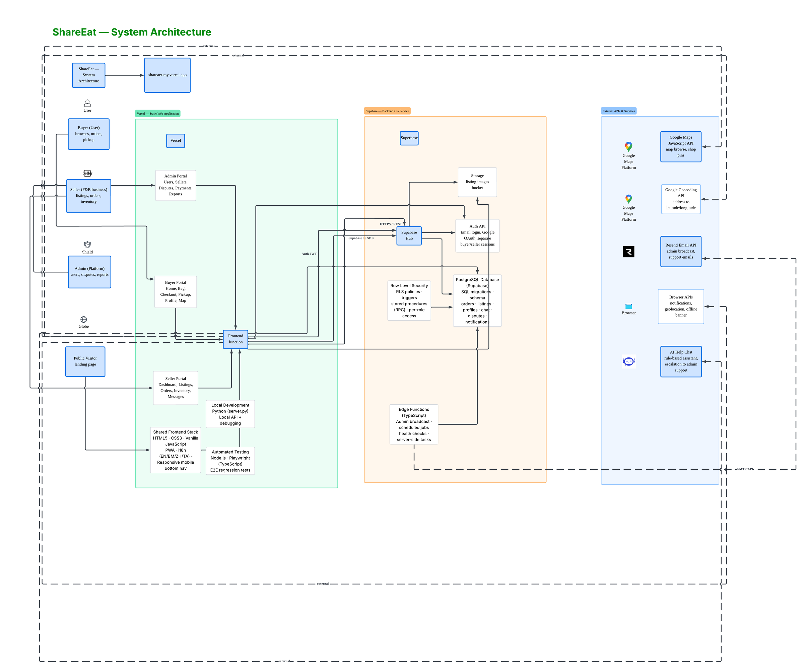

# ShareEat – System Architecture

This document describes the high-level architecture of the ShareEat food rescue / last-minute deals platform as implemented in this codebase.

---

## 1. High-Level Overview

ShareEat is a **client–server web app** with a static frontend and Supabase as the backend (Auth, Database, Storage). There are no custom application servers; the browser talks directly to Supabase.

<p align="center">
  
</p>

---

## 2. User Roles & Entry Points

| Role      | Auth storage key        | Typical entry              | Main pages |
|-----------|-------------------------|----------------------------|------------|
| **User**  | `shareeat-user-auth`    | login.html, register.html  | user-home, bag, checkout, pickup, profile, user-messages |
| **Seller**| `shareeat-seller-auth`  | seller-login, seller-register | seller-dashboard, seller-listings, seller-orders, seller-inventory, seller-messages |
| **Admin** | `shareeat-seller-auth`  | admin-login, admin-register   | admin-* (if present) |
| **Public**| —                       | index.html                 | Landing only; browse may show active listings |

The app uses **two Supabase client instances** so the same browser can be logged in as both User and Seller in different tabs without one session overwriting the other. The active client is chosen by URL: `seller-*` and `admin-*` (and `listing-detail.html`) use the seller client; everything else uses the user client.

---

## 3. Frontend Structure (Pages & Flows)

### 3.1 Public & User (Buyer) Journey

| Page            | Purpose |
|-----------------|--------|
| index.html      | Landing / marketing |
| login.html      | User login |
| register.html   | User registration |
| user-home.html  | Browse active listings (filter by category chips), add to bag |
| user-listing-detail.html / listing-detail.html | Listing detail; add to bag |
| bag.html        | Cart; go to checkout |
| checkout.html   | Contact, payment method; place order → creates `orders` + `order_items` |
| pickup.html     | Order status, “We’ll keep you updated”, quick actions (Map, Call, Chat, Ask a friend) |
| profile.html    | User profile, quick actions (e.g. Chat with seller), order history, ratings |
| user-messages.html | Order-based conversations with sellers |

### 3.2 Seller Journey

| Page                 | Purpose |
|----------------------|--------|
| seller-login.html    | Seller login |
| seller-register.html | Seller registration |
| seller-dashboard.html| Overview (listings, orders) |
| seller-listings.html| CRUD food listings (create/edit/delete, image upload) |
| seller-orders.html  | Order management: Accept/Reject, Complete; tabs (All, Pending, Ready, Completed, Cancelled) |
| seller-inventory.html | Inventory by listing: stats (Total, In Stock, Low Stock, Critical), Add/Remove stock, Update min quantity |
| seller-messages.html| Conversations per order; reply, mark read |

### 3.3 Admin

| Page              | Purpose |
|-------------------|--------|
| admin-login.html  | Admin login |
| admin-register.html | Admin registration |

(Admin-specific features depend on what’s implemented in admin-* pages.)

---

## 4. Database Schema (Supabase / Postgres)

Core tables and relationships:

```
auth.users (Supabase managed)
    │
    ├── profiles (id, full_name, role, contact_email?)
    │       └── role: 'user' | 'seller' | 'admin'
    │
    ├── listings (seller_id, title, description, image_url, total_quantity, available,
    │             original_price, discount_price, category, min_quantity, address, ...)
    │       └── RLS: public read active; seller CRUD own
    │       └── Storage: listing-images bucket for images
    │
    ├── orders (buyer_id, contact_email, contact_phone, payment_method, subtotal,
    │           service_fee, total, status, rejected_at, rejection_reason, rejection_comment)
    │       └── status: pending | confirmed | ready | completed | cancelled
    │
    │   └── order_items (order_id, listing_id, seller_id, quantity, unit_price,
    │                    store_name, listing_title, pickup_time, status)
    │           └── Trigger: AFTER INSERT → reduce listings.available
    │
    ├── order_messages (order_id, sender_id, receiver_id, body, read_at)
    │       └── Buyer ↔ Seller chat per order
    │
    ├── order_pickup_tokens (order_id, token, created_by)   [Ask a friend]
    │
    ├── user_favorites (user_id, listing_id)
    ├── saved_addresses (user_id, ...)
    ├── notification_preferences (user_id, ...)
    ├── reviews (user_id, listing_id, order_id, quality_rating, service_rating, value_rating, ...)
    └── payment_methods (user_id, ...)
```

### 4.1 Key Tables Summary

| Table            | Purpose |
|------------------|--------|
| **profiles**     | Extended user info (name, role); created by trigger on `auth.users` insert |
| **listings**     | Seller food items; `available` / `min_quantity` drive inventory and stock sync |
| **orders**       | One per checkout; buyer and contact info; rejection fields for seller reject |
| **order_items**  | Line items; link order ↔ listing ↔ seller; trigger decrements `listings.available` |
| **order_messages** | Per-order chat between buyer and seller |
| **order_pickup_tokens** | Share pickup link (Ask a friend) |
| **reviews**      | Ratings/reviews (e.g. quality, service, value); optional order_id |
| **user_favorites**, **saved_addresses**, **notification_preferences**, **payment_methods** | User preferences and profile features |

### 4.2 RPCs / Server-Side Logic

| Function / trigger                         | When / purpose |
|--------------------------------------------|----------------|
| **handle_new_user()**                      | Trigger on `auth.users` INSERT → insert `profiles` row |
| **reduce_listing_stock_on_order_item()**   | Trigger on `order_items` INSERT → decrement `listings.available` |
| **reject_order_by_seller(p_order_id, p_reason, p_comment)** | Restore stock for seller’s items, set order + items to cancelled, set rejection fields |

All access is enforced with **Row Level Security (RLS)** so that buyers see only their orders/messages, sellers only their listings/orders/items/messages, and public sees only active listings.

---

## 5. Key Business Flows

### 5.1 Order & Stock Sync

1. **User** adds items to bag on user-home / listing-detail (client-side cart, e.g. localStorage).
2. **Checkout** (checkout.js): validate contact and (optionally) stock; insert `orders` row, then `order_items` rows.
3. **Trigger** `trg_order_item_reduce_stock` runs on each `order_items` INSERT and decrements `listings.available` for that `listing_id`.
4. **User** sees updated availability on user-home (listings refetched from DB). **Seller** sees updated stock on seller-inventory (same `listings` table).

So: one source of truth (`listings.available`); no separate “inventory” table for stock.

### 5.2 Seller Rejects Order

1. Seller clicks Reject on seller-orders → modal (reason + optional comment) → calls **reject_order_by_seller** RPC.
2. RPC: restores `listings.available` for that order’s items for this seller; sets order and those order_items to cancelled; sets `rejected_at`, `rejection_reason`, `rejection_comment`.
3. Buyer sees rejected state and message on pickup.html (rejected card / reason + comment).

### 5.3 Messaging (Chat with Seller)

1. **order_messages**: one row per message; `order_id`, `sender_id`, `receiver_id`, `body`, `read_at`.
2. Buyer: profile quick action “Chat with Seller” → user-messages.html; pickup “Chat with Seller” opens chat for current order.
3. Seller: seller-orders (message icon per order) → seller-messages.html; list conversations by order, reply, mark read.
4. Optional: notification check (e.g. notification-check.js) for unread messages and toast/link to user-messages.

### 5.4 Seller Completes Order

1. Seller marks order/item as Complete on seller-orders.
2. Optional: auto-send an `order_messages` row to buyer (e.g. “Your order is complete, please come pick up”).
3. Order/item appears under Completed tab; buyer sees status on pickup.

---

## 6. Storage

- **Bucket: listing-images** (public read). Sellers upload listing images via seller-listings; URLs stored in `listings.image_url`. Policies: authenticated upload; public read; owner update/delete.

---

## 7. Technology Stack (Summary)

| Layer      | Technology |
|-----------|------------|
| Frontend  | Static HTML, CSS, vanilla JavaScript |
| Auth & API| Supabase JS client (Auth + REST for Postgres) |
| Database  | Supabase (PostgreSQL), RLS, triggers, RPCs |
| Storage   | Supabase Storage (listing-images) |
| Hosting   | Any static host (e.g. Vercel, Netlify, or file server); no Node/backend required |

---

## 8. File Layout (Logical)

```
PROJECT_02_2026/
├── index.html, login.html, register.html          # Public / user auth
├── user-home.html, bag.html, checkout.html, pickup.html, profile.html, user-messages.html
├── user-listing-detail.html, listing-detail.html  # Listing detail
├── seller-*.html                                  # Seller dashboard, listings, orders, inventory, messages
├── admin-*.html                                   # Admin
├── js/
│   ├── supabase-config.js                         # Dual Supabase clients
│   ├── checkout.js, pickup.js, profile.js         # User flows
│   ├── user-home.js, (bag, listing-detail…)        # Browse & cart
│   ├── seller-orders.js, seller-inventory.js, seller-messages.js, …
│   └── notification-check.js                       # Unread message toasts
├── supabase-*.sql                                 # Schema, RLS, triggers, RPCs (private source repo)
└── SYSTEM_ARCHITECTURE.md                         # This document
```

This is the system architecture of ShareEat as implemented in your codebase: static frontend, Supabase for auth and data, single source of truth for stock (`listings.available`) with sync on order and reject, and clear separation between user (buyer) and seller flows and auth.
