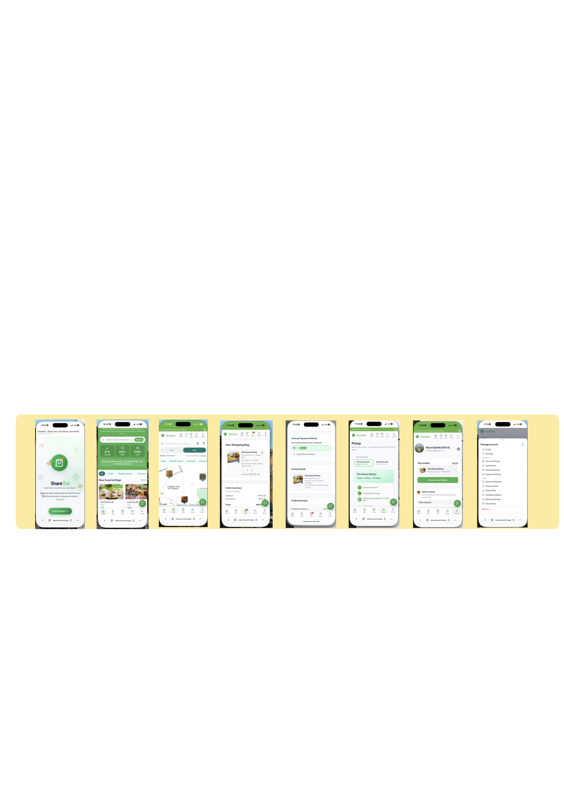
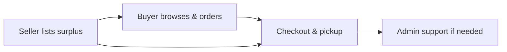
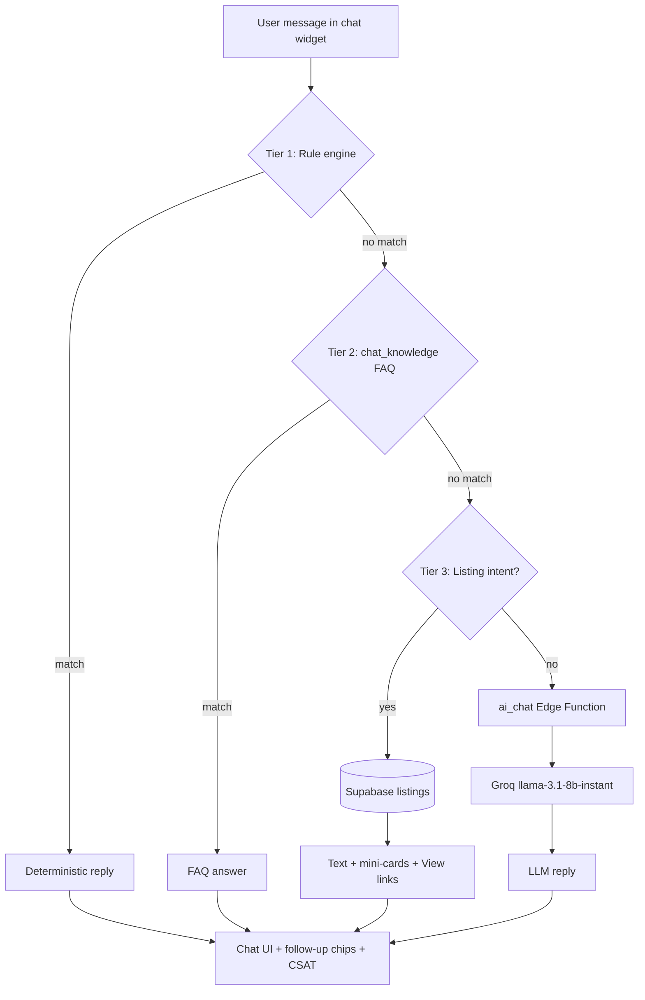

  

<h1 align="center">ShareEat</h1>

  <strong>Full-stack surplus-food marketplace · Malaysia</strong> 
  <em>Save food · Save money · Save Earth</em>

  
  
  
  
  

  
  
  
  
  
  

  <a href="#about">About</a> ·
  <a href="#highlights">Highlights</a> ·
  <a href="#live-demo">Live demo</a> ·
  <a href="#architecture">Architecture</a> ·
  <a href="#features">Features</a> ·
  <a href="#engineering">Engineering</a> ·
  <a href="#tech-stack">Tech stack</a> ·
  <a href="#ai-assistant--fyp-report-pack-chapters-4--6">AI (FYP)</a> ·
  <a href="#documentation">Documentation</a> ·
  <a href="#author">Author</a>

---

## About

**ShareEat** is a production-style web platform that connects food businesses with customers to rescue edible surplus before it is discarded. Sellers list unsold items at reduced prices; buyers browse, order, and collect within a pickup window; administrators manage users, disputes, and platform operations.

Built as a **Final Year Project (2026)** in Software Engineering — designed, developed, and deployed end-to-end by a solo developer.

| | |
|---|---|
| **Problem** | Edible food is thrown away at closing time while people nearby want affordable meals. |
| **Solution** | One platform for listings, checkout, pickup, messaging, notifications, and admin support. |
| **Impact** | Less waste · lower prices · seller revenue recovery · tracked savings (meals, CO₂, RM) |
| **Market** | Malaysia — multilingual UI (EN / BM / ZH / TA), local maps and addresses |
| **SDGs** | UN SDG **12** (Responsible Consumption) · SDG **13** (Climate Action) |

> **Public documentation repository.** This repo showcases architecture, design decisions, and FYP materials. Application source code is **private** and not published here.

---

## Highlights

> *What makes this more than a CRUD app — built for real users, real roles, and real deployment.*

| | |
|---|---|
| **3 role-based portals** | Buyer, Seller, and Admin — each with dedicated workflows and access control |
| **Live production deploy** | Hosted on Vercel with Supabase backend — not localhost-only |
| **Security by design** | PostgreSQL Row Level Security (RLS), role-based auth, dual session model |
| **Multilingual product** | Full UI in English, Bahasa Malaysia, Chinese, and Tamil |
| **Real-world integrations** | Google Maps, Resend email, Supabase Edge Functions, PWA support |
| **Mobile-first buyer PWA** | Buyer app optimized for phone; seller & admin portals for desktop |
| **Documented end-to-end** | Architecture diagrams, schema docs, FYP requirements, 25+ markdown guides |

### By the numbers

| Metric | Count |
|--------|------:|
| Web pages (HTML) | 45+ |
| JavaScript modules | 70+ |
| SQL migrations & policies | 70+ |
| User roles | 3 |
| Supported languages | 4 |
| Documentation files | 25+ |

---

## Live demo

Try the deployed app — no install required.

| Portal | URL | Recommended device |
|--------|-----|--------------------|
| **Home** | [shareeat-my.vercel.app](https://shareeat-my.vercel.app/) | Any |
| **Buyer** | [shareeat-my.vercel.app/user](https://shareeat-my.vercel.app/user) | **Mobile** (PWA) |
| **Seller** | [shareeat-my.vercel.app/seller](https://shareeat-my.vercel.app/seller) | **Desktop** |
| **Admin** | [shareeat-my.vercel.app/admin](https://shareeat-my.vercel.app/admin) | **Desktop** |

**Support:** [support@shareeat.my](mailto:support@shareeat.my)

### User experience (Buyer)

ShareEat is a **PWA (Progressive Web App)** — optimized for mobile. **Buyers** should use ShareEat on their **phone** (add to home screen for app-like access). **Seller** and **Admin** portals are designed for **desktop** use.

  

Buyer journey — browse, order, and collect surplus food on mobile

---

## Architecture

ShareEat uses a **static frontend on Vercel** with **Supabase** as the backend (PostgreSQL, Auth, Storage, RLS, Edge Functions). The browser communicates directly with Supabase — no custom Node/API server to maintain.

  

Users & roles · Frontend (Vercel) · Backend (Supabase) · External APIs (Google Maps, Resend, AI Help Chat)

**Order flow:**

Deep dive → **[SYSTEM_ARCHITECTURE.md](SYSTEM_ARCHITECTURE.md)** · **[SYSTEM_DESIGN.md](SYSTEM_DESIGN.md)** · **[BACKEND.md](BACKEND.md)**

---

## Features

### Buyer

- Browse home, map, and shop views with filters (category, time, price, free items)
- Bag, checkout, pickup tracking, and order history
- Profile — addresses, favourites, notifications, multi-language UI
- Order chat with seller, issue reporting, AI help chat
- Impact dashboard — meals saved, CO₂ avoided, money saved, badges

### Seller

- Dashboard with orders, revenue, and analytics
- Listing management — price, stock, images, pickup window, promotions
- Order lifecycle — confirm, prepare, ready, complete, reject
- Inventory and low-stock alerts
- Per-order customer messaging and store settings

### Admin

- User and seller management, global listings oversight
- Support desk and order disputes with buyer replies
- Payments, reports, preparation queue, audit logs
- Broadcast email, content management, localisation, feature flags

---

## Engineering

Technical decisions that matter to developers reviewing this project.

### Key design choices

| Decision | Rationale |
|----------|-----------|
| **Supabase BaaS** | Auth, Postgres, Storage, and RLS in one platform — ship faster without maintaining a custom API server |
| **Vanilla JavaScript** | No framework lock-in; direct control over performance, PWA behaviour, and page-level logic |
| **Dual auth clients** | Separate Supabase sessions for buyer vs seller/admin so one browser can hold both roles in different tabs |
| **RLS-first security** | Data access enforced at the database layer — not only in frontend code |
| **DB triggers & RPCs** | Stock sync, order lifecycle, and inventory consistency handled server-side |
| **Edge Functions** | Admin broadcast email and scheduled jobs without a dedicated backend host |

### Quality & reliability

- Automated tests for checkout math and i18n key parity
- GitHub Actions CI on push
- Pre-push secret scanning (`check-secrets`)
- Docker option for reproducible local runs
- Playwright E2E test suite (source repo)

### Skills demonstrated

`System Design` · `Full-Stack Development` · `PostgreSQL & RLS` · `REST / Supabase SDK` · `OAuth & Session Auth` · `Cloud Deployment (Vercel)` · `Third-Party API Integration` · `Responsive / Mobile UI` · `Internationalization (i18n)` · `Technical Documentation` · `CI/CD` · `Security Awareness`

---

## Tech stack

| Layer | Technologies |
|-------|----------------|
| **Frontend** | HTML5, CSS3, vanilla JavaScript, PWA, responsive mobile nav |
| **Portals** | Buyer · Seller · Admin (single codebase) |
| **Backend** | Supabase — PostgreSQL, Auth, Storage, RLS, Edge Functions |
| **Email** | Resend (`shareeat.my`) |
| **Maps** | Google Maps JavaScript API + Geocoding API |
| **Hosting** | Vercel (primary), Docker optional |
| **Tooling** | Node.js, Playwright, GitHub Actions |

| Integration | Purpose |
|-------------|---------|
| Supabase Auth | Email login, Google OAuth, role-based sessions |
| Supabase PostgREST | Orders, listings, chat, notifications, disputes |
| Supabase Storage | Listing images |
| Supabase Edge Functions | Admin broadcast, scheduled jobs |
| Google Maps / Geocoding | Map browse, shop pins, address geocoding |
| Resend | Transactional and admin email |

> Checkout UI includes FPX / card flows; live payment gateway is on the [roadmap](#roadmap).

---

## AI Assistant — FYP Report Pack (Chapters 4 & 6)

Copy-paste sections for your **CPT6314 Project II** report, viva demo, and testing.  
**Full pack:** [docs/FYP-AI-REPORT-PACK.md](docs/FYP-AI-REPORT-PACK.md) · **Visual diagram:** [docs/ai-architecture-diagram.html](docs/ai-architecture-diagram.html) (open in browser → export PNG for Word)

### Chapter 4 — AI architecture

**Figure 4.X Layered Architecture of the ShareEat AI Assistant**

> Figure 4.X illustrates the layered architecture of the ShareEat AI Assistant. User input is evaluated sequentially through a rule-based engine, a trainable FAQ database (`chat_knowledge`), and live listing retrieval from Supabase. Only unresolved queries invoke the Groq large language model via the `ai_chat` Supabase Edge Function, where the API key is stored server-side.

**One-liner:** Rules → FAQ → Live listings → Groq via Edge Function — API key never in the browser.

### Chapter 6 — AI test table (summary)

| Test ID | Category | Test input | Expected result |
|---------|----------|------------|-----------------|
| T-AI-01 | Rule engine | “Can I cancel after the store confirms?” | Pending vs confirmed cancellation reply |
| T-AI-02 | Live listings | “List free food” | Free listings from DB with View links |
| T-AI-03 | Live listings | “Show cheap options” | Listings sorted by price |
| T-AI-04 | FAQ | “What makes ShareEat different from delivery apps?” | Pickup-only answer |
| T-AI-05 | Navigation | Tap “Go to Profile” chip | Redirect to profile |
| T-AI-06 | Rate limiting | 11+ messages in 1 minute | Rate-limit message |
| T-AI-07 | LLM fallback | Creative open-ended question | Groq-generated reply |
| T-AI-08 | LLM proxy | POST to `ai_chat` Edge Function | JSON `{ "reply": "..." }` |
| T-AI-09 | Security | Network tab on LLM query | No Groq key in client |
| T-AI-10 | CSAT | Thumbs down on reply | Feedback acknowledgment |

Full table with **Actual result / Pass** columns → [docs/FYP-AI-REPORT-PACK.md](docs/FYP-AI-REPORT-PACK.md)

### Viva demo script (~2 min)

| Step | Say to examiner | Type in chat |
|------|-----------------|--------------|
| 1 | “First, live data — not AI guessing.” | **List free food** |
| 2 | “Second, FAQ database — no API cost.” | **What makes ShareEat different from regular delivery apps?** |
| 3 | “Third, Groq LLM when rules and FAQ don’t match.” | **Write a one-line poem about saving food from waste** |

**Page:** Buyer home · **Hard refresh:** Cmd+Shift+R before demo

More detail (limitations, checklist, backup lines) → [docs/FYP-AI-REPORT-PACK.md](docs/FYP-AI-REPORT-PACK.md) · [docs/AI-ASSISTANT.md](docs/AI-ASSISTANT.md)

---

Public documentation in this repository:

| Topic | Document |
|-------|----------|
| System architecture | [SYSTEM_ARCHITECTURE.md](SYSTEM_ARCHITECTURE.md) |
| System design & decisions | [SYSTEM_DESIGN.md](SYSTEM_DESIGN.md) |
| Backend & data flow | [BACKEND.md](BACKEND.md) |
| Class / data model | [docs/CLASS-DIAGRAM.md](docs/CLASS-DIAGRAM.md) |
| Schema visualization | [docs/SCHEMA-VISUALIZATION.md](docs/SCHEMA-VISUALIZATION.md) |
| Business & revenue model | [REVENUE_EXPLAINED.md](REVENUE_EXPLAINED.md) |
| FYP requirements | [docs/FYP_FUNCTIONAL_REQUIREMENTS_TABLE.md](docs/FYP_FUNCTIONAL_REQUIREMENTS_TABLE.md) |
| FYP demo & report guide | [FYP-RUNBOOK.md](FYP-RUNBOOK.md) |
| FYP AI report pack (Ch. 4 & 6) | [docs/FYP-AI-REPORT-PACK.md](docs/FYP-AI-REPORT-PACK.md) |
| AI architecture diagram | [docs/ai-architecture-diagram.html](docs/ai-architecture-diagram.html) |
| Full doc index | [docs/README.md](docs/README.md) |

---

## Roadmap

**Shipped (v1.0)**

- Three-role marketplace (buyer, seller, admin)
- Order disputes, admin replies, in-app notifications
- Multi-language UI (EN / BM / ZH / TA)
- Impact tracking, badges, AI help chat
- Mobile bottom navigation, automated tests, CI

**Planned**

- Live payment gateway (FPX / e-wallet)
- Push notifications and native mobile app
- AI API integration for chat
- Nationwide seller onboarding and ESG impact reporting

---

## Author

<table>
  <tr>
    <td width="120"></td>
    <td>
      <strong>Myra Ophelia Iman Binti Maurice Feizal</strong> 
      Bachelor of Software Engineering · Final Year Project · 2026  
      Full-stack developer — designed, built, and deployed ShareEat end-to-end.  
      <!-- Replace # with your profile URLs -->
      <a href="https://github.com/MyraOphelia">GitHub</a> ·
      <a href="https://www.linkedin.com/in/myra-ophelia-iman">LinkedIn</a> ·
      <a href="mailto:support@shareeat.my">Email</a> ·
      <a href="https://shareeat-my.vercel.app/">Live demo</a>
    </td>
  </tr>
</table>

**Interested in the project?** Star this repo, try the [live demo](https://shareeat-my.vercel.app/), or connect on LinkedIn — happy to walk through the architecture.

---

## License

Academic coursework — all rights reserved by **Myra Ophelia Iman Binti Maurice Feizal** unless stated by the institution. See **[LICENSE](LICENSE)**.
