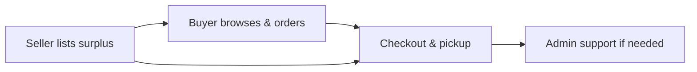

  

<h1 align="center">ShareEat</h1>

  <strong>Surplus-food marketplace for Malaysia</strong> 
  Save food · Save money · Save Earth

  
  
  
  

  <a href="#about">About</a> ·
  <a href="#live-demo">Live demo</a> ·
  <a href="#architecture">Architecture</a> ·
  <a href="#features">Features</a> ·
  <a href="#tech-stack">Tech stack</a> ·
  <a href="#learn-more">Learn more</a> ·
  <a href="#roadmap">Roadmap</a> ·
  <a href="#author">Author</a>

---

## About

**ShareEat** connects food businesses with customers to rescue edible surplus before it is discarded. Sellers list unsold items at reduced prices; buyers browse, order, and collect within a pickup window; administrators oversee users, listings, disputes, and platform operations.

| | |
|---|---|
| **Problem** | Edible food is thrown away at closing time while people nearby want affordable meals. |
| **Solution** | A single platform for listings, checkout, pickup, messaging, notifications, and admin support. |
| **Impact** | Less waste · lower prices · seller revenue recovery · tracked savings (meals, CO₂, RM) |
| **Market** | Malaysia — multilingual UI (EN / BM / ZH / TA), local maps and addresses |

> **Public documentation repository.** This repo shares project overview, architecture, and FYP materials. Application source code is **not published** here.

---

## Live demo

| Portal | URL |
|--------|-----|
| **Home** | [shareeat-my.vercel.app](https://shareeat-my.vercel.app/) |
| **Buyer** | [shareeat-my.vercel.app/user](https://shareeat-my.vercel.app/user) |
| **Seller** | [shareeat-my.vercel.app/seller](https://shareeat-my.vercel.app/seller) |
| **Admin** | [shareeat-my.vercel.app/admin](https://shareeat-my.vercel.app/admin) |

**Support:** [support@shareeat.my](mailto:support@shareeat.my)

---

## Architecture

ShareEat is a web application hosted on **Vercel**, with **Supabase** handling authentication, database, storage, and server-side logic.

  

Users & roles · Frontend (Vercel) · Backend (Supabase) · External APIs (Google Maps, Resend, AI Help Chat)

**Order flow (simplified):**

---

## Features

### Buyer

- Browse home, map, and shop views with filters (category, time, price, free items)
- Bag, checkout, pickup tracking, and order history
- Profile — addresses, favourites, notifications, multi-language UI
- Order chat with seller, issue reporting, AI help chat
- Impact dashboard — meals saved, CO₂ avoided, money saved, badges

### Seller

- Dashboard with orders, revenue, and analytics
- Listing management — price, stock, images, pickup window, promotions
- Order lifecycle — confirm, prepare, ready, complete, reject
- Inventory and low-stock alerts
- Per-order customer messaging and store settings

### Admin

- User and seller management, global listings oversight
- Support desk and order disputes with buyer replies
- Payments, reports, preparation queue, audit logs
- Broadcast email, content management, localisation, feature flags

---

## Tech stack

| Layer | Technologies |
|-------|----------------|
| **Frontend** | HTML5, CSS3, JavaScript, PWA, responsive mobile design |
| **Portals** | Buyer · Seller · Admin |
| **Backend** | Supabase (PostgreSQL, Auth, Storage, Edge Functions) |
| **Email** | Resend |
| **Maps** | Google Maps Platform |
| **Hosting** | Vercel |

---

## Learn more

Public documentation in this repository:

| Topic | Document |
|-------|----------|
| System architecture | [SYSTEM_ARCHITECTURE.md](SYSTEM_ARCHITECTURE.md) |
| System design | [SYSTEM_DESIGN.md](SYSTEM_DESIGN.md) |
| Backend overview | [BACKEND.md](BACKEND.md) |
| Business & revenue model | [REVENUE_EXPLAINED.md](REVENUE_EXPLAINED.md) |
| FYP requirements | [docs/FYP_FUNCTIONAL_REQUIREMENTS_TABLE.md](docs/FYP_FUNCTIONAL_REQUIREMENTS_TABLE.md) |
| FYP demo & report guide | [docs/FYP-RUNBOOK.md](docs/FYP-RUNBOOK.md) |
| Full doc index | [docs/README.md](docs/README.md) |

---

## Roadmap

**Shipped (v1.0)**

- Three-role marketplace (buyer, seller, admin)
- Order disputes, admin replies, in-app notifications
- Multi-language UI (EN / BM / ZH / TA)
- Impact tracking, badges, AI help chat
- Mobile bottom navigation

**Planned**

- Live payment gateway (FPX / e-wallet)
- Push notifications and native mobile app
- AI API integration for chat
- Nationwide seller onboarding and ESG impact reporting

---

## Author

| | |
|---|---|
| **Name** | Myra Ophelia Iman Binti Maurice Feizal |
| **Programme** | Bachelor of Software Engineering — Final Year Project |
| **Year** | 2026 |
| **Version** | v1.0 |

ShareEat aligns with UN SDGs **12** (Responsible Consumption) and **13** (Climate Action).

---

## License

Academic coursework — all rights reserved by **Myra Ophelia Iman Binti Maurice Feizal** unless stated by the institution. See **[LICENSE](LICENSE)**.
