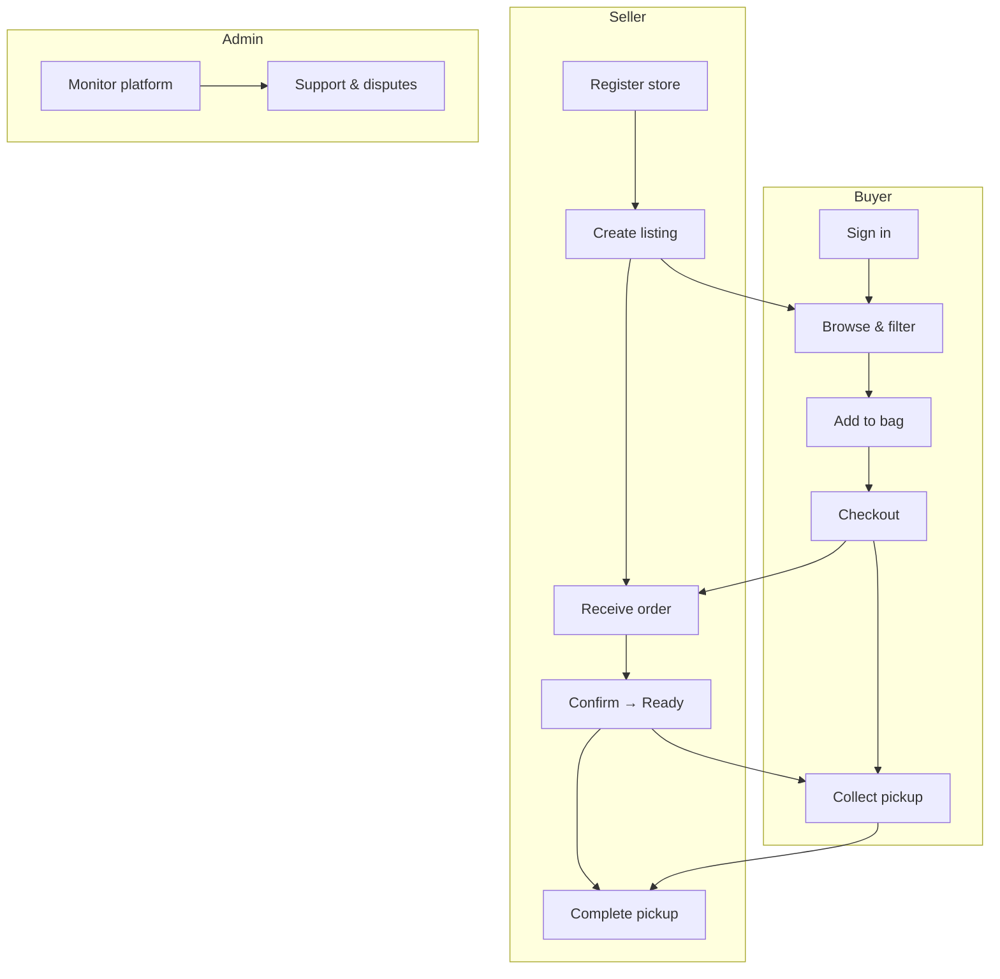
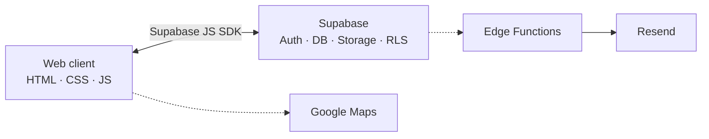

<p align="center">
  <a href="https://shareeat-my.vercel.app/">
    
  </a>
</p>

<h1 align="center">ShareEat</h1>

<p align="center"><strong>Save Food · Save Money · Save Earth</strong></p>

<p align="center">
  <a href="https://shareeat-my.vercel.app/"></a>
  <a href="https://vercel.com"></a>
  <a href="https://supabase.com"></a>
</p>

<p align="center">
  <a href="#-quick-links">Quick links</a> ·
  <a href="#-introduction">Introduction</a> ·
  <a href="#-features">Features</a> ·
  <a href="#-technology">Technology</a> ·
  <a href="#-getting-started">Getting started</a> ·
  <a href="#-documentation">Documentation</a> ·
  <a href="#-security">Security</a> ·
  <a href="#-roadmap">Roadmap</a> ·
  <a href="#-contact">Contact</a>
</p>

---

## 📌 Quick links

| What you need | Go here |
|---------------|---------|
| **Try the live app** | [shareeat-my.vercel.app](https://shareeat-my.vercel.app/) |
| **Run locally** | [Getting started → Local](#-run-locally) |
| **Set up Supabase** | [SETUP.md](SETUP.md) |
| **Run SQL migrations** | [docs/MIGRATIONS.md](docs/MIGRATIONS.md) |
| **Deploy to Vercel** | [docs/VERCEL_DEPLOYMENT.md](docs/VERCEL_DEPLOYMENT.md) |
| **All docs (index)** | [docs/README.md](docs/README.md) |
| **FYP requirements** | [docs/FYP_FUNCTIONAL_REQUIREMENTS_TABLE.md](docs/FYP_FUNCTIONAL_REQUIREMENTS_TABLE.md) |

### Live portals

| Role | URL |
|------|-----|
| **Home** | [shareeat-my.vercel.app](https://shareeat-my.vercel.app/) |
| **Buyer** | [shareeat-my.vercel.app/user](https://shareeat-my.vercel.app/user) |
| **Seller** | [shareeat-my.vercel.app/seller](https://shareeat-my.vercel.app/seller) |
| **Admin** | [shareeat-my.vercel.app/admin](https://shareeat-my.vercel.app/admin) |

---

## 📖 Introduction

### Overview

**ShareEat** is a web-based surplus-food marketplace for Malaysia. Food businesses (**sellers**) list unsold but still-edible items; customers (**users**) browse, order, pay, and collect within a pickup window; **administrators** oversee users, listings, disputes, and platform operations.

| | |
|---|---|
| **Problem** | Edible food is thrown away at closing time while people want affordable meals nearby. |
| **Solution** | One platform for listing, checkout, pickup, chat, notifications, and admin support. |
| **Value** | Less waste · lower prices · seller revenue recovery · impact tracking (meals, CO₂, RM). |
| **Live** | **[shareeat-my.vercel.app](https://shareeat-my.vercel.app/)** |

### How it works



### Roles

| Role | Who | Main tasks |
|------|-----|------------|
| **User (Buyer)** | Customer | Browse, order, pickup, chat, profile, impact |
| **Seller** | F&B business | Listings, stock, orders, messages, analytics |
| **Administrator** | Platform staff | Users, sellers, disputes, reports, settings |

### Project information

| | |
|---|---|
| **Author** | Myra Ophelia Iman Binti Maurice Feizal |
| **Programme** | Bachelor of Software Engineering — Final Year Project |
| **Year** | 2026 |
| **Version** | v1.0 |

---

## ✨ Features

<details>
<summary><strong>🛒 Buyer (User)</strong></summary>

- Browse home, map, and shop views with filters (category, time, price, free items)
- Bag, checkout, pickup tracking, order history
- Profile — addresses, favourites, notifications, multi-language (EN / BM / ZH / TA)
- Order chat with seller · report issues · AI help chat
- Impact dashboard — meals saved, CO₂ avoided, money saved, badges

</details>

<details>
<summary><strong>🏪 Seller</strong></summary>

- Dashboard — orders, revenue, analytics
- Listing CRUD — price, stock, images, pickup window, promotions
- Order lifecycle — confirm, prepare, ready, complete, reject
- Inventory & low-stock alerts
- Customer messaging per order · store settings

</details>

<details>
<summary><strong>🛡️ Admin</strong></summary>

- User & seller management · global listings oversight
- Support desk · order disputes with buyer replies
- Payments, reports, preparation queue, audit logs
- Broadcast email · content · localisation · feature flags

</details>

---

## 💼 Business model

| Element | Approach |
|---------|----------|
| **Revenue** | Service / commission fee per transaction |
| **Seller value** | Recover revenue from surplus stock; no listing fee |
| **Buyer value** | Discounted food with clear pickup terms |
| **Free listings** | Donation-style listings supported |
| **Scale** | Vercel + Supabase; sellers self-onboard |
| **Market** | Malaysia — 4 languages, local maps & addresses |

---

## 🛠 Technology

### Tech stack

| Layer | Technologies |
|-------|----------------|
| **Front end** | HTML5, CSS3, JavaScript (vanilla), PWA, responsive mobile nav |
| **Web portals** | Buyer · Seller · Admin (single codebase) |
| **Backend** | Supabase — PostgreSQL, Auth, Storage, RLS, Edge Functions |
| **Email** | Resend (`shareeat.my`) |
| **Maps** | Google Maps JavaScript API + Geocoding API |
| **Hosting** | Vercel (primary) · Docker optional |
| **Tooling** | Node.js scripts · `npm test` · GitHub Actions CI |

### APIs used

| API | Purpose |
|-----|---------|
| **Supabase Auth** | Login, register, Google OAuth, sessions |
| **Supabase PostgREST** | Orders, listings, chat, notifications, disputes |
| **Supabase Storage** | Listing images |
| **Supabase Edge Functions** | Admin broadcast, scheduled email, server jobs |
| **Google Maps / Geocoding** | Map browse, shop pins, address → coordinates |
| **Resend** | Transactional & admin email |
| **Browser APIs** | Notifications, geolocation, speech (chat), offline banner |

> Checkout shows FPX / card UI; live payment gateway is planned (see [Roadmap](#-roadmap)).

### Architecture



### Automated tests

```bash
npm test
npm run check-secrets   # before every push
```

| Test | Guards |
|------|--------|
| `tests/checkout-math.test.mjs` | Totals, discounts, fees |
| `tests/shareeat-i18n.test.mjs` | i18n keys across locales |

CI: `.github/workflows/test.yml`

---

## 🚀 Getting started

### Run locally

```bash
cp js/supabase-config.example.js js/supabase-config.js   # add your Supabase keys
./run.sh                                                 # http://localhost:3000
```

Optional map key: `js/map-config.local.js` · Full steps: **[SETUP.md](SETUP.md)**

### Run with Docker

```bash
cp docker/sample.env .env
docker compose up --build    # http://localhost:8080
```

### Project structure

```
├── index.html, user-*.html, seller-*.html, admin-*.html
├── js/                    # Auth, checkout, admin, i18n, map, profile, …
├── css/                   # Page & role styles
├── supabase-*.sql         # Migrations & RLS
├── supabase/functions/    # Edge functions
├── docs/                  # Full documentation index → docs/README.md
├── tests/                 # Checkout math, i18n
└── scripts/               # Build & utilities
```

---

## 📚 Documentation

> **Full index with descriptions:** [docs/README.md](docs/README.md)

### Setup & deployment

| Document | Description |
|----------|-------------|
| [SETUP.md](SETUP.md) | Local config, Supabase, Docker |
| [SUPABASE_SETUP.md](SUPABASE_SETUP.md) | Supabase project & API keys |
| [docs/MIGRATIONS.md](docs/MIGRATIONS.md) | SQL migration hub |
| [docs/SUPABASE_MIGRATION_RUNBOOK.md](docs/SUPABASE_MIGRATION_RUNBOOK.md) | Phased SQL run order |
| [docs/SUPABASE_SETUP_ORDER.md](docs/SUPABASE_SETUP_ORDER.md) | Setup order reference |
| [docs/VERCEL_DEPLOYMENT.md](docs/VERCEL_DEPLOYMENT.md) | Production deploy & env vars |

### Architecture & backend

| Document | Description |
|----------|-------------|
| [SYSTEM_ARCHITECTURE.md](SYSTEM_ARCHITECTURE.md) | Pages, flows, schema overview |
| [SYSTEM_DESIGN.md](SYSTEM_DESIGN.md) | Design goals & decisions |
| [BACKEND.md](BACKEND.md) | Data flow, RLS, triggers |
| [docs/CLASS-DIAGRAM.md](docs/CLASS-DIAGRAM.md) | Class / data model |
| [docs/SCHEMA-VISUALIZATION.md](docs/SCHEMA-VISUALIZATION.md) | Schema diagrams |
| [REVENUE_EXPLAINED.md](REVENUE_EXPLAINED.md) | Fees & revenue logic |

### Admin & operations

| Document | Description |
|----------|-------------|
| [docs/ADMIN_ADVANCEMENT.md](docs/ADMIN_ADVANCEMENT.md) | Admin feature overview |
| [docs/ADMIN_COMMUNICATION.md](docs/ADMIN_COMMUNICATION.md) | Broadcast email |
| [docs/AUTH_OPS.md](docs/AUTH_OPS.md) | Auth operations |
| [docs/AI-ASSISTANT.md](docs/AI-ASSISTANT.md) | Help chat widget |

### FYP & academic

| Document | Description |
|----------|-------------|
| [docs/FYP_FUNCTIONAL_REQUIREMENTS_TABLE.md](docs/FYP_FUNCTIONAL_REQUIREMENTS_TABLE.md) | Requirements table |
| [docs/FYP-RUNBOOK.md](docs/FYP-RUNBOOK.md) | Demo & report runbook |

### Security & maintenance

| Document | Description |
|----------|-------------|
| [SECURITY.md](SECURITY.md) | Secrets, RLS, safe dev |
| [PRE_PUSH_REVIEW.md](PRE_PUSH_REVIEW.md) | Pre-push checklist |
| [LISTING_IMAGES_FIX.md](LISTING_IMAGES_FIX.md) | Image loading notes |
| [CACHING_FIX.md](CACHING_FIX.md) | Cache behaviour |

---

## 🔒 Security

- Do **not** commit `js/supabase-config.js`, `.env`, or service-role keys.
- The anon key is public; **RLS** and auth protect data.
- Run `npm run check-secrets` before every push.

Details: **[SECURITY.md](SECURITY.md)**

---

## 🗺 Roadmap

### v1.0 (current)

- Three-role marketplace (buyer, seller, admin)
- Order disputes · admin replies · notifications
- Multi-language UI (EN / BM / ZH / TA)
- Impact tracking & badges · AI help chat
- Mobile bottom nav · automated tests & CI

### Planned

- Live payment gateway (FPX / e-wallet)
- Push notifications & native mobile app
- AI API for chat · nationwide seller scale-up
- ESG impact reporting

---

## 📬 Contact

| | |
|---|---|
| **Live app** | [shareeat-my.vercel.app](https://shareeat-my.vercel.app/) |
| **Support** | [support@shareeat.my](mailto:support@shareeat.my) |
| **Author** | Myra Ophelia Iman Binti Maurice Feizal |

Aligns with UN SDGs **12** (Responsible Consumption) and **13** (Climate Action).

---

## 📄 License

Academic coursework — all rights reserved by **Myra Ophelia Iman Binti Maurice Feizal** unless stated by the institution. See [LICENSE](LICENSE).
